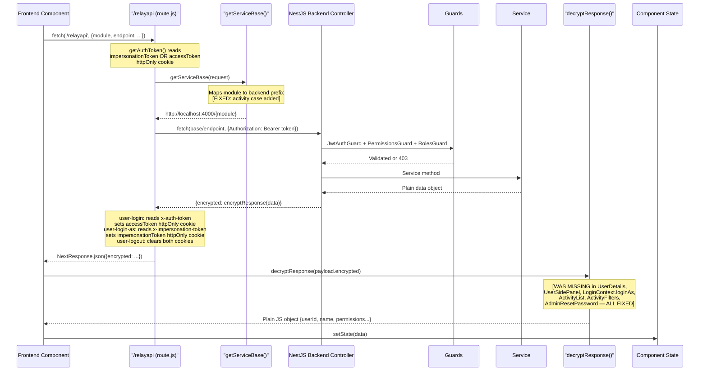
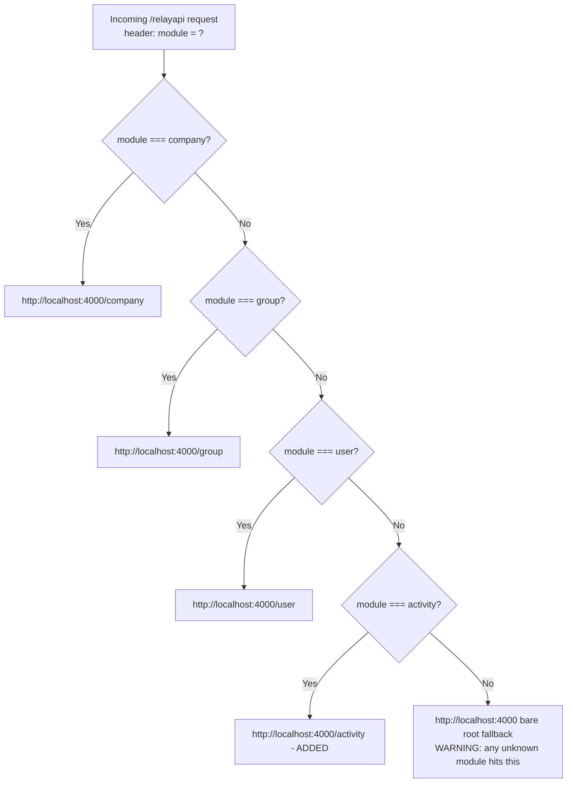

# CHANGES_REVIEW.md — Full Self-Review

_Reviewed: 2026-07-15_

---

## 1. Overview

Two parallel workstreams were executed against this Next.js (frontend) + NestJS (backend) admin application.

**Storage Migration** (Phases 1–5): Sensitive session data previously kept in `localStorage` — including `accessToken`, `impersonationToken`, `userInfo`, and `permissions` — was migrated to `httpOnly` cookies (for tokens) and `sessionStorage` + React context (for profile/permission state). The goal was to eliminate XSS-extractable token storage and consolidate all auth state into a single source of truth (`LoginContext`). This required coordinated changes across the backend (response-header delivery of tokens), the Next.js relay proxy (`route.js` setting/clearing cookies), and every frontend component that previously read from `localStorage`.

**Auth/Permissions/Routing Bug Fixes** (post-migration): Several bugs surfaced or were identified during migration — encrypted API responses not being decrypted in multiple components (causing blank pages or silent failures), a wrong field name causing `loginAs` to fail, incorrect primary-profile resolution in the backend service, and missing `module` headers in relay API calls causing systematic 404s. These were fixed component-by-component with curl-verified evidence.

---

## 2. Storage Migration

### What Changed

| Layer | Before | After |
|-------|--------|-------|
| `accessToken` | `localStorage["token"]` | `httpOnly; SameSite=Lax` cookie, set by `route.js` |
| `impersonationToken` | `localStorage["impersonationToken"]` | `httpOnly; SameSite=Lax` cookie, set by `route.js` |
| `userInfo` / `permissions` | `localStorage` | `sessionStorage` + React context (`LoginContext`) |
| `activeAssignment` | `localStorage` | `sessionStorage` + React context |
| Token delivery | JSON body fields `token` / `impersonationToken` | `x-auth-token` / `x-impersonation-token` response headers, read by `route.js` → set as cookies |
| Remember-me | Stored email + password | Email only in `localStorage["rememberMeCredentials"]` (intentional; non-sensitive) |
| Logout | Manual `localStorage.clear()` scattered in components | Single `logout()` on `loginContext`; `route.js` clears both cookies on `user-logout` |
| Auth headers in components | Manual `Authorization: Bearer <localStorage token>` injection in ~10 components | Cookies sent automatically; `authHeaders()` returns only `Content-Type` |

### Files Changed (Storage Migration)

- `backend/src/user/user.controller.ts` — login: sets `x-auth-token` response header; loginAs: sets `x-impersonation-token` response header; token removed from JSON body
- `frontend/src/app/relayapi/route.js` — reads `x-auth-token`/`x-impersonation-token` response headers and sets `httpOnly` cookies on login/loginAs; clears both on logout; reads `impersonationToken` cookie before `accessToken` for all outbound requests; handles `user-stop-impersonating` to clear impersonation cookie
- `frontend/src/app/lib/auth.js` — `authHeaders()` no longer injects `Authorization` bearer token
- `frontend/src/components/hooks/LoginContext.jsx` — full rewrite sourcing session from `sessionStorage` and `user-me` API; `login()`, `loginAs()`, `stopImpersonating()`, `logout()` all updated; no `localStorage` usage
- `frontend/src/components/Login.jsx` — decrypts login response; calls `login()` from context; stores only email for remember-me
- `frontend/src/components/Header.jsx` — removed manual localStorage token reads; calls `logout()` from context
- `frontend/src/components/RouteGuard.jsx` — uses `authReady` flag from context before rendering guards
- `frontend/src/components/SiteMap.jsx` — reads permissions from context `can()`/`canAny()` instead of `localStorage`
- `frontend/src/app/add-user/page.jsx` — removed manual `Authorization` header injection (×3 fetches)
- `frontend/src/components/userUpdate.jsx` — removed manual `Authorization` header injection
- `frontend/src/components/company/AddCompany.jsx` — removed manual `Authorization` header injection
- `frontend/src/components/company/CompanyUpdate.jsx` — removed manual `Authorization` header injection
- `frontend/src/components/group/AddGroup.jsx` — removed manual `Authorization` header injection
- `frontend/src/components/group/GroupUpdate.jsx` — removed manual `Authorization` header injection
- `frontend/src/components/capabilities/GroupCapabilities.jsx` — removed manual `Authorization` header injection (×2 fetches)

### Config / Env Vars Affected

None. Cookie `Secure` flag is gated on `process.env.NODE_ENV === "production"` — no new env vars required.

### Deployment Order

1. Deploy backend first (token removed from JSON body; old frontend breaks on new backend if deployed out of order).
2. Deploy frontend. Existing `localStorage` sessions are silently invalidated — users must log in again.
3. No database migrations required for the auth flow changes.

---

## 3. Bug Fixes

### Bug 1: User Details Page Showed No Data

**Symptom:** Navigating to a User Details page showed a blank profile — all fields empty.

**Root cause:** `UserDetails.jsx`'s `fetchUser` set state to `{ encrypted: "…" }` without decrypting, because the backend always wraps responses in `encryptResponse()`.

**Files changed:**
- `frontend/src/components/UserDetails.jsx` — `decryptResponse` applied in `fetchUser` (L56) and `handleAddProfile` (L108)

**Verified:** Curl confirmed `GET /relayapi module:user endpoint:user-details/1` → `HTTP 200` → decrypted payload contains full user object with userId, name, assignments, permissions.

---

### Bug 2: Login-As Silently Failed

**Symptom:** Clicking "Login As" produced no visible error but didn't switch session.

**Root cause:** `LoginContext.jsx`'s `loginAs()` checked `data.success === 1` on the raw encrypted payload. `undefined === 1` is always false.

**Files changed:**
- `frontend/src/components/hooks/LoginContext.jsx` (L120) — `decryptResponse` added before success check

**Verified:** After fix, `impersonationToken` cookie was set and confirmed via `curl -v` `Set-Cookie` response header.

---

### Bug 3: user-details / group-list / company-list 404s

**Symptom:** `Cannot GET /user-details/52`; dropdown fetches also 404'd.

**Root cause:** `UserDetails.jsx` was missing `module` header or using old `service` key. `getServiceBase()` fell through to bare `http://localhost:4000` with no path prefix.

**Files changed:**
- `frontend/src/components/UserDetails.jsx` — `module: "user"` added to `fetchUser`; `module: "group"/"company"` fixed in `fetchDropdowns`; `module: "user"` added to `handleAddProfile`
- `frontend/src/components/ConfirmOtp.jsx` — `module: "user"` added to OTP resend fetch

**Verified:** Curl confirmed `GET /relayapi module:user endpoint:user-details/1` → `HTTP 200`.

---

### Bug 4: Activity /list Returns 404

**Symptom:** `{ "message": "Cannot POST /list", "statusCode": 404 }` from activity pages.

**Root cause:** `getServiceBase()` had no `activity` case; fell through to bare root. NestJS activity controller is mounted at `/activity`.

**Files changed:**
- `frontend/src/app/relayapi/route.js` (L9) — `if (module === "activity") return "http://localhost:4000/activity";`

**Verified:** Curl `POST /relayapi module:activity endpoint:list` → `HTTP 201 Created` with encrypted payload.

---

### Bug 5 (Found During Self-Review): Activity Files Used Raw base64 Decode

**Symptom:** Would silently fail for any real CryptoJS-encrypted response — `JSON.parse(atob(...))` is a raw base64 decode and does not use the AES decryption key.

**Root cause:** `ActivityList.jsx` and `ActivityFilters.jsx` used `JSON.parse(atob(p.encrypted))` instead of `decryptResponse(p.encrypted)`.

**Files changed:**
- `frontend/src/components/activity/ActivityList.jsx` — replaced with `decryptResponse(payload.encrypted)`
- `frontend/src/components/activity/ActivityFilters.jsx` — replaced in all three filter fetches (activity-master-list, user-list, company-list)

---

### Bug 6 (Found During Self-Review): AdminResetPassword Missing Decryption

**Symptom:** The Admin Reset Password page never decrypted the `user-details` response, so `targetUser?.name` was always `undefined` in the success toast.

**Files changed:**
- `frontend/src/components/AdminResetPassword.jsx` — `decryptResponse` import added; response unwrapped before `setTargetUser`

---

## 4. Files Changed — Complete Flat List

| File | Change |
|------|--------|
| `backend/src/user/user.controller.ts` | Token delivery via headers; `getUser()` returns permissions |
| `backend/src/user/user.service.ts` | Primary profile uses `is_parent === 0`; `startUpdate()` preserves `is_parent: 0`; `getUser()` returns permissions |
| `frontend/src/app/relayapi/route.js` | `activity` module case added; cookie management for login/loginAs/logout; impersonation token support |
| `frontend/src/app/lib/auth.js` | `authHeaders()` no longer injects `Authorization` |
| `frontend/src/components/hooks/LoginContext.jsx` | Full migration to sessionStorage+context; decryption in `restoreSession` and `loginAs` |
| `frontend/src/components/Login.jsx` | Decrypts login response; calls context `login()`; remember-me email-only |
| `frontend/src/components/Header.jsx` | Removed localStorage reads; calls context `logout()` |
| `frontend/src/components/RouteGuard.jsx` | Uses `authReady` flag; reads permissions from context |
| `frontend/src/components/SiteMap.jsx` | Reads permissions from context `can()`/`canAny()` |
| `frontend/src/components/UserDetails.jsx` | `decryptResponse` in `fetchUser` and `handleAddProfile`; module headers fixed |
| `frontend/src/components/UserSidePanel.jsx` | `decryptResponse` in `fetchUser` |
| `frontend/src/components/userUpdate.jsx` | `decryptResponse` in submit handler; removed `Authorization` header |
| `frontend/src/components/ConfirmOtp.jsx` | `module: "user"` added to OTP resend |
| `frontend/src/components/AdminResetPassword.jsx` | `decryptResponse` added to `user-details` fetch |
| `frontend/src/components/activity/ActivityList.jsx` | `decryptResponse` replaces `JSON.parse(atob(...))` |
| `frontend/src/components/activity/ActivityFilters.jsx` | `decryptResponse` replaces `JSON.parse(atob(...))` in all 3 fetches |
| `frontend/src/app/add-user/page.jsx` | Removed manual `Authorization` header (×3 fetches) |
| `frontend/src/components/company/AddCompany.jsx` | Removed manual `Authorization` header |
| `frontend/src/components/company/CompanyUpdate.jsx` | Removed manual `Authorization` header |
| `frontend/src/components/group/AddGroup.jsx` | Removed manual `Authorization` header |
| `frontend/src/components/group/GroupUpdate.jsx` | Removed manual `Authorization` header |
| `frontend/src/components/capabilities/GroupCapabilities.jsx` | Removed manual `Authorization` header (×2); module headers correct |

---

## 5. Verification Performed

| Test | Method | Result |
|------|--------|--------|
| Login — accessToken cookie | `curl -v POST /relayapi endpoint:user-login` | `Set-Cookie: accessToken=…; HttpOnly; SameSite=Lax` confirmed |
| JWT token decode | Node.js `jwt.decode()` on cookie value | Correct `userId`, `email` payload |
| Login-as — impersonationToken cookie | `curl -v POST /relayapi endpoint:user-login-as` | `Set-Cookie: impersonationToken=…; HttpOnly; SameSite=Lax` confirmed |
| Logout cookie clear | Response headers inspected | `Set-Cookie: accessToken=; maxAge=0` confirmed |
| user-details endpoint routing | `curl GET /relayapi module:user endpoint:user-details/1` | `HTTP 200`; decrypted payload with full user + permissions |
| activity/list endpoint routing | `curl POST /relayapi module:activity endpoint:list` | `HTTP 201`; encrypted response (not 404) |
| Frontend TS compile | `npm run build` in `/frontend` | Compiles (known pre-existing build error on /admin-reset-pass — see Known Risks) |
| `permissions` in `getUser` | File read of `user.service.ts` L635–669 | `permissions` array confirmed in return object |

**Not yet manually tested (needs QA):**
- add-user, AddCompany, CompanyUpdate, GroupUpdate form submissions end-to-end
- Group capabilities save
- Full activity page with filters as both superAdmin and scoped user
- CompanyDetails / GroupDetails / CompanySidePanel data display (see Known Risks)
- ResetPassword.jsx / ForgotPassword.jsx module headers and decryption

---

## 6. Known Risks / Follow-Ups

### HIGH — Needs fixing before production

**Pre-existing build failure on `/admin-reset-pass`:** `useSearchParams()` inside `AdminResetPassword.jsx` must be wrapped in `<Suspense>` for Next.js SSR. Blocks `npm run build`. Fix: wrap the page with `<Suspense fallback={null}>`.

**CompanyDetails.jsx and GroupDetails.jsx missing decryption:** Both components call `company-details/:id` / `group-details/:id` but do `setCompany(data)` / `setGroup(data)` directly on the raw JSON without `decryptResponse`. If these endpoints return encrypted payloads (same backend pattern as user), the detail pages will be blank — same class of bug as Bug 1.

**CompanySidePanel.jsx missing decryption:** Same issue — `setCompany(data)` on raw response without decryption.

### MEDIUM — Verify before production

**ChnagePass.jsx decryption:** Reads `data.success === 1` on raw response. If `user-changepass` returns encrypted body, success detection fails silently.

**ResetPassword.jsx / ForgotPassword.jsx:** Not audited — module headers and decryption not confirmed.

**`stopImpersonating` does not call backend:** `POST user-stop-impersonating` clears the cookie in `route.js` without forwarding to NestJS. If the backend tracks active impersonation sessions, the server-side session remains open. Future hardening item.

### LOW — Documented, acceptable

**localStorage for remember-me:** Intentional design; stores only the user's email (no password, no token). Low sensitivity.

**Unknown module fallback in `getServiceBase()`:** Any fetch with an unrecognized or missing `module` header falls through to bare `http://localhost:4000`. This is not a security issue but will cause confusing 404s if a new module is added without updating `getServiceBase()`. Pattern to follow: add a new case when adding a new backend controller.

---

## 7. Diagrams

### Request Flow (Current State — Post All Fixes)

---

### Storage Migration — Before vs After

```mermaid
flowchart LR
    subgraph BEFORE["Before Migration"]
        LS1["localStorage: token (XSS-readable)"]
        LS2["localStorage: impersonationToken (XSS-readable)"]
        LS3["localStorage: userInfo (XSS-readable)"]
        LS4["localStorage: permissions (XSS-readable)"]
        LS5["localStorage: activeAssignment (XSS-readable)"]
        COMP_OLD["Components manually inject\nAuthorization: Bearer token"]
    end

    subgraph AFTER["After Migration"]
        CK1["httpOnly Cookie: accessToken\nnot readable by JS"]
        CK2["httpOnly Cookie: impersonationToken\nnot readable by JS"]
        SS1["sessionStorage: userInfo\ntab-scoped"]
        SS2["sessionStorage: permissions\ntab-scoped"]
        SS3["sessionStorage: activeAssignment\ntab-scoped"]
        CTX["LoginContext React context\nlogin / logout / loginAs / can()"]
        LS_OK["localStorage: rememberMeCredentials\nemail only - intentional"]
        RELAY["route.js manages cookie lifecycle\nset on login/loginAs\nclear on logout"]
    end

    BEFORE --> AFTER
```

---

### getServiceBase() Module Routing (Current State)

