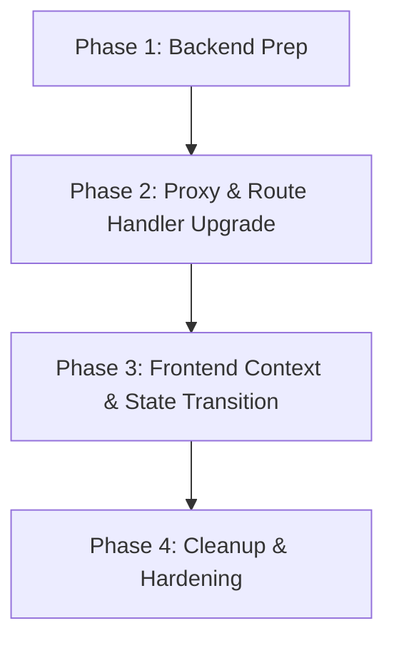

# Client-Side Storage Migration Plan

This document details the plan to migrate client-side storage mechanisms to align each piece of session, user, and authorization data with the appropriate security profile and storage tier.

---

## 1. Data Inventory Table

| Data Item | Current Storage | Set At | Read At (All Call Sites) | Sensitivity | Recommended Storage | Why |
| :--- | :--- | :--- | :--- | :--- | :--- | :--- |
| **accessToken** | `localStorage` | `Login.jsx` (L117) | - `auth.js` (L15) - `add-user/page.jsx` (L107, L129, L252) - `userUpdate.jsx` (L338) - `AddCompany.jsx` (L197) - `CompanyUpdate.jsx` (L251) - `RouteGuard.jsx` (L29) - `GroupUpdate.jsx` (L76) - `AddGroup.jsx` (L67) - `LoginContext.jsx` (L51) - `GroupCapabilities.jsx` (L147, L158) | **High** | `httpOnly`, `Secure`, `SameSite=Lax` Cookie | Bearer token granting complete user privileges. Highly vulnerable to XSS extraction when placed in `localStorage`. |
| **refreshToken** | `localStorage` | `Login.jsx` (L118) | None (redundant field, not read currently) | **High** | `httpOnly`, `Secure`, `SameSite=Lax` Cookie | If used, allows obtaining new access tokens. Must be protected from XSS. |
| **impersonationToken** | `localStorage` | `LoginContext.jsx` (L117) | - `auth.js` (L71, L76) - `LoginContext.jsx` (L144, L195) | **High** | `httpOnly`, `Secure`, `SameSite=Lax` Cookie | Grants session delegation access to other user accounts. Sensitive to theft/impersonation. |
| **session cookie** | Plain Client Cookie | `Login.jsx` (L124) | - `proxy.js` (L4) - `LoginContext.jsx` (L198) (Cleared) - `Header.jsx` (L159) (Cleared) | **Medium** | `httpOnly`, `Secure`, `SameSite=Lax` Cookie | Gatekeeper cookie used by Next.js middleware `proxy.js` to authorize routes. |
| **loggedIn cookie** | Plain Client Cookie | `Login.jsx` (L125) | - `proxy.js` (L5) - `LoginContext.jsx` (L43, L199) - `Header.jsx` (L101, L157) | **Medium** | In-Memory / Context State (Derived from verified JWT) | Currently holds raw `userId` used to fetch user details. Easily manipulated in devtools. |
| **userInfo** | `localStorage` | - `LoginContext.jsx` (L89) - `Login.jsx` (L119) | - `auth.js` (L6) - `Column.jsx` (L58) - `UserList.jsx` (L67) - `LoginContext.jsx` (L18) - `SiteMap.jsx` (L16) | **Low** | In-Memory State / `sessionStorage` fallback | Metadata and profile settings. Safe to hold in-memory, but must not be used as the sole trust anchor for identity. |
| **permissions** | `localStorage` | - `LoginContext.jsx` (L92) - `Login.jsx` (L120) | - `auth.js` (L54) - `LoginContext.jsx` (L37, L150) | **Medium** | In-Memory State / `sessionStorage` fallback | Leakage of the role/permission matrix facilitates targeted privilege-escalation and endpoint reconnaissance, raising sensitivity above Low. |
| **activeAssignment** | `localStorage` | - `LoginContext.jsx` (L25, L132, L156, L173) | - `LoginContext.jsx` (L24, L122, L153) | **Low** | In-Memory State / `sessionStorage` fallback | Keeps track of the currently selected user profile/company assignment. |
| **originalActiveAssignment** | `localStorage` | - `LoginContext.jsx` (L123) | - `LoginContext.jsx` (L153) | **Low** | In-Memory State / `sessionStorage` fallback | Stores assignment state during impersonation to restore afterwards. |
| **impersonatedUser** | `localStorage` | - `LoginContext.jsx` (L118) | - `LoginContext.jsx` (L31) | **Low** | In-Memory State / `sessionStorage` fallback | Metadata about the impersonated target user. |
| **impersonatedPermissions** | `localStorage` | - `LoginContext.jsx` (L119) | - `LoginContext.jsx` (L34) | **Low** | In-Memory State / `sessionStorage` fallback | Temporary delegation permissions. |
| **resetToken** | `sessionStorage` | `ConfirmOtp.jsx` | `ResetPassword.jsx` | **Medium** | `sessionStorage` | Short-lived bearer credential confirming password OTP verification; sessionStorage keeps it restricted to the browser tab lifetime. |
| **resetEmail** | `sessionStorage` | `ForgotPassword.jsx` | `ConfirmOtp.jsx` | **Low** | `sessionStorage` | Email identity helper for tracking verification state. |
| **rememberMeCredentials (identifier)** | `localStorage` | `Login.jsx` (L67) | `Login.jsx` (L38) | **Low** | `localStorage` | Username/email auto-fill helper. |
| **rememberMeCredentials (password)** | `localStorage` (Encrypted) | `Login.jsx` (L67) | `Login.jsx` (L38) | **High** | **Do Not Store** | Hardcoded key `hiddenbrainspune` client-side renders client-side AES encryption completely useless. |
| **"token" key** | `localStorage` | None (Dead reference) | `Header.jsx` (L163) (Cleared) | **None** | **Remove** | Dead code reference; `accessToken` is used instead. |

---

## 2. Storage-Mechanism Guidelines

1. **HttpOnly Cookies**:
   - Apply to: `accessToken`, `refreshToken`, `impersonationToken`, and `session`.
   - **Rationale**: Mitigates Cross-Site Scripting (XSS) attacks by preventing client-side scripts from reading token values. The browser automatically appends these cookies to requests heading to the backend.
2. **In-Memory Context State (with SessionStorage Fallback)**:
   - Apply to: `userInfo`, `permissions`, `activeAssignment`, `originalActiveAssignment`, `impersonatedUser`, `impersonatedPermissions`.
   - **Rationale**: Information that is not highly sensitive but is frequently read for UI rendering (like gating elements by permissions). It does not outlive the browser tab session, reducing exposure compared to persistent `localStorage`.
3. **No Client-Side Password Storage**:
   - Apply to: `rememberMeCredentials` (password).
   - **Rationale**: Never persist passwords. Redesign "Remember Me" to either:
     - **Option A**: Only save the user identifier (email/username) for auto-fill convenience.
     - **Option B**: Issue a long-lived `refresh_token` cookie from the backend that automatically re-authenticates the user.
4. **Fix Identity Trust Model**:
   - Redesign client identity verification so that identity is always derived server-side from the validated JWT token rather than trusting a client-supplied raw `loggedIn` user ID.

---

## 3. Required Changes Per Layer

### Backend (NestJS)
- **Endpoints**: `user-login`, `user-login-as`, `user-logout`, `user-refresh`.
- **Changes**:
  - Upon successful login/impersonation, attach the `accessToken` and `impersonationToken` as `httpOnly`, `Secure`, `SameSite=Lax` cookies using response headers instead of returning them in the JSON body.
  - Implement a `GET /me` (or update `user-me`) endpoint that returns `userInfo` based on the JWT payload parsed server-side.
  - Clear the token cookies during logout.

### Frontend API Proxy (`frontend/src/app/relayapi/route.js`)
- **Changes**:
  - Stop reading `Authorization` or `x-impersonation-token` from the incoming request headers.
  - Instead, read the cookie values server-side using `request.cookies.get('accessToken')?.value` and `request.cookies.get('impersonationToken')?.value`.
  - Inject these values as the `Authorization: Bearer <token>` header before forwarding the request to the NestJS backend.

### Frontend Route Gating and Guard
- **`frontend/src/proxy.js`**:
  - Update route matching to gate pages based on the presence of the new `accessToken` cookie.
- **`frontend/src/components/RouteGuard.jsx`**:
  - Replace `!localStorage.getItem("accessToken")` (L29) check with an in-memory check or an API check of the current authentication state from `LoginContext`.

### Context & Shared Components
- **`frontend/src/components/hooks/LoginContext.jsx`**:
  - Remove all token getters/setters/removers for `localStorage` (L51, L117, L144, L191, L195).
  - Consolidate cleanup logic. The `logout()` function should invoke the logout API which will clear cookies server-side.
  - Keep `userInfo` and `permissions` in local React state and cache them in `sessionStorage` to survive page refreshes without hitting the network continuously.
- **`frontend/src/components/Header.jsx`**:
  - Remove local state and custom cookie clearing logic from `gotoLogout` (L156-L164).
  - Use the `logout` function provided by `LoginContext` to trigger the centralized logout workflow (ensuring the `user-logout` activity log event is recorded).

### Individual Components Direct Reads
- **Direct LocalStorage Access (To be updated to use Context state)**:
  - `frontend/src/components/Column.jsx` (L58)
  - `frontend/src/components/UserList.jsx` (L67)
  - `frontend/src/components/SiteMap.jsx` (L16)
- **Direct Headers Injection (To be cleaned up to rely on Proxy cookie attachment)**:
  - `frontend/src/app/add-user/page.jsx` (L107, L129, L252)
  - `frontend/src/components/userUpdate.jsx` (L338)
  - `frontend/src/components/company/AddCompany.jsx` (L197)
  - `frontend/src/components/company/CompanyUpdate.jsx` (L251)
  - `frontend/src/components/group/GroupUpdate.jsx` (L76)
  - `frontend/src/components/group/AddGroup.jsx` (L67)
  - `frontend/src/components/capabilities/GroupCapabilities.jsx` (L147, L158)
  - Change all above fetch calls to omit the manual `Authorization` header injection.

---

## 4. Migration Sequencing & Phases

### Phase 1: Backend Preparation
1. Add cookie set/clear logic to the NestJS login/impersonate/logout controllers.
2. During the transition phase, **keep returning** the tokens in the JSON response payload. This prevents breaking the client while the frontend migration is in progress.

### Phase 2: API Proxy Upgrade
1. Update `frontend/src/app/relayapi/route.js` to look for both the header (fallback) and cookies.
2. Update Next.js middleware (`proxy.js`) to read the secure `accessToken` cookie.

### Phase 3: Frontend Context and State Transition
1. Rewrite `LoginContext.jsx` to load initial state from a lightweight `sessionStorage` fallback rather than `localStorage`.
2. Consolidate `Header.jsx` logout to delegate to `LoginContext.logout()`.
3. Update `Login.jsx` to only save the email identifier in `rememberMeCredentials`. Stop saving password credentials entirely.

### Phase 4: Cleanup & Hardening
1. Remove token outputs from NestJS backend JSON response bodies.
2. Remove all manual headers injection and manual `localStorage.getItem("accessToken")` calls in individual frontend page/component forms.
3. Consolidate the sessionStorage and React state writes inside `Login.jsx`'s login success path into a centralized `login()` method exposed by `LoginContext`, matching `logout()`.

---

## 5. Open Questions & Risks

1. **Cross-Domain vs. Same-Domain Cookies**:
   - If frontend and backend are hosted on different domains, cookies will require `SameSite=None` and `Secure`, along with credentials configurations on both CORS and fetch calls (`credentials: 'include'`).
   - If they are behind a single domain/reverse proxy, `SameSite=Lax` is ideal.
2. **Impersonation Context Separation**:
   - Should impersonation use a distinctly named cookie (`impersonationToken`) or overwrite the main session token?
   - **Recommendation**: Use a separate cookie (`impersonationToken`). This makes restoring the original session easier (simply delete the impersonation cookie).
