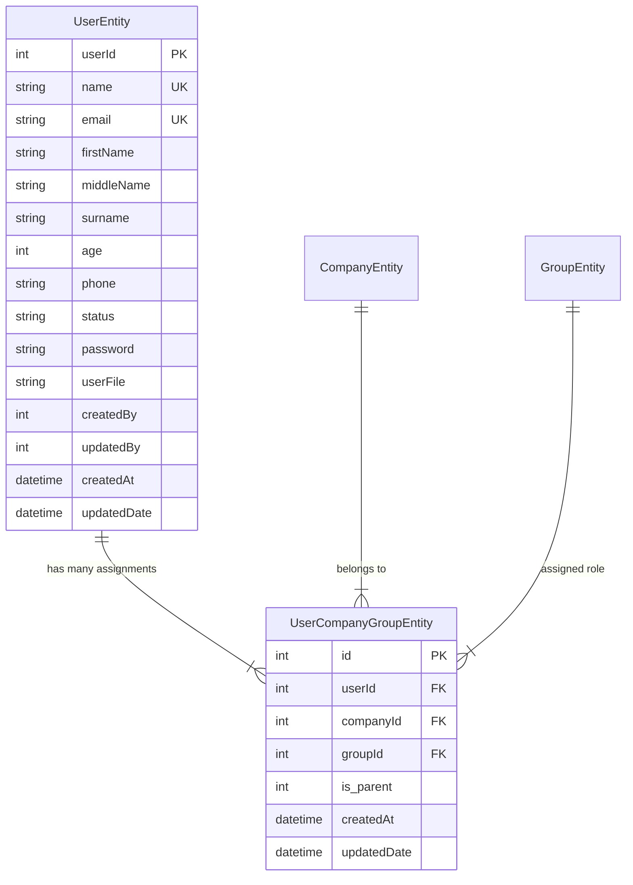

# User Module Architecture & Technical Reference (`USER_MODULE.md`)

This document provides a comprehensive, end-to-end technical deep dive into the **User Module** of this application. It covers backend controllers, services, entities, DTOs, security guards, frontend pages, components, context state management, cross-cutting concerns (company scoping, impersonation, activity logging), and known code issues.

---

## Table of Contents
1. [Overview](#1-overview)
2. [Data Model & Database Schemas](#2-data-model--database-schemas)
3. [Authentication & Authorization Mechanics](#3-authentication--authorization-mechanics)
4. [Backend Layer Deep Dive](#4-backend-layer-deep-dive)
   - [User Controller (`user.controller.ts`)](#user-controller-usercontentrollerts)
   - [User Service (`user.service.ts`)](#user-service-userservicets)
   - [Data Transfer Objects (`user.dto.ts`)](#data-transfer-objects-userdtots)
5. [Frontend Layer Deep Dive](#5-frontend-layer-deep-dive)
   - [Session & State Management (`LoginContext.jsx`)](#session--state-management-logincontextjsx)
   - [User Listing & Table (`UserList.jsx` & `Column.jsx`)](#user-listing--table-userlistjsx--columnjsx)
   - [Add User Flow (`add-user/page.jsx`)](#add-user-flow-add-userpagejsx)
   - [Update User Flow (`userUpdate.jsx`)](#update-user-flow-userupdatejsx)
   - [User Details & Profile Management (`UserDetails.jsx`)](#user-details--profile-management-userdetailsjsx)
   - [Authentication Helpers (`auth.js`)](#authentication-helpers-authjs)
6. [Feature-by-Feature End-to-End Walkthroughs](#6-feature-by-feature-end-to-end-walkthroughs)
7. [Company-Hierarchy Scoping](#7-company-hierarchy-scoping)
8. [Activity Logging Integration](#8-activity-logging-integration)
9. [Known Issues & Technical Debt](#9-known-issues--technical-debt)

---

## 1. Overview

The User Module is responsible for managing identity, user credentials, role/company profile assignments, authentication sessions, profile switching, authorization gating, and user impersonation ("Login As"). 

A central architectural pattern in this module is **multi-profile assignment**: a single human user (represented by `UserEntity`) can possess multiple profile assignments across different companies and roles (represented by `UserCompanyGroupEntity`). Exactly one profile assignment per user is flagged as primary (`is_parent: 0`), while secondary assignments are flagged with `is_parent: 1`.

---

## 2. Data Model & Database Schemas

### 2.1 Entity Relationship Diagram



### 2.2 Entity Details

#### `UserEntity` ([user.entity.ts](file:///var/www/html/project/backend/src/packages/entity/user.entity.ts))
Mapped to database table `'user'`.
- `userId` (`number`, Primary Generated Column): Unique identifier for the user record.
- `name` (`string`, Unique, Non-nullable): System username used for login and display.
- `email` (`string`, Unique, Non-nullable): User email address.
- `password` (`string`, Non-nullable): Hashed user password.
- `firstName`, `middleName`, `surname` (`string`, Nullable): Split name fields.
- `age` (`number`, Non-nullable): User age.
- `phone`, `dialCode`, `alternatePhone` (`string`, Nullable): Contact phone numbers.
- `status` (`string`, Non-nullable): User status (`'Active'` or `'Inactive'`).
- `userFile` (`string | null`, Nullable): File path or filename for the uploaded profile image.
- `createdBy`, `updatedBy` (`number`, Nullable): `userId` of the admin who created or modified this user.
- `createdAt`, `updatedDate` (`Date`): Audit timestamps.
- **Relation**: `@OneToMany(() => UserCompanyGroupEntity, (ucg) => ucg.user, { cascade: true })`

#### `UserCompanyGroupEntity` ([user.company.group.entity.ts](file:///var/www/html/project/backend/src/packages/entity/user.company.group.entity.ts))
Mapped to database table `'user_company_group'`.
- `id` (`number`, Primary Generated Column): Profile assignment ID.
- `userId` (`number`, Foreign Key to `UserEntity`): Owner of the assignment.
- `companyId` (`number`, Foreign Key to `CompanyEntity`): Associated company.
- `groupId` (`number`, Foreign Key to `GroupEntity`): Associated role/permission group.
- `is_parent` (`number`, Default: `0`): Flag designating primary profile (`0`) vs secondary profile (`1`).
- **Relations**:
  - `@ManyToOne(() => UserEntity)` (`onDelete: 'CASCADE'`)
  - `@ManyToOne(() => CompanyEntity)` (`onDelete: 'CASCADE'`)
  - `@ManyToOne(() => GroupEntity)` (`onDelete: 'CASCADE'`)

---

## 3. Authentication & Authorization Mechanics

### 3.1 Token Strategy ([jwt.strategy.ts](file:///var/www/html/project/backend/src/utilities/jwt.strategy.ts))
Passport JWT Strategy extracts `Bearer <token>` from the HTTP `Authorization` header. Decoded JWT payloads populate `req.user`:

```typescript
async validate(payload: any) {
  return {
    userId: payload.userId,
    email: payload.email,
    profileId: payload.profileId,
    impersonatedBy: payload.impersonatedBy,
    impersonatorEmail: payload.impersonatorEmail,
    isImpersonation: payload.isImpersonation,
  };
}
```

### 3.2 Context Resolution ([auth-helper.ts](file:///var/www/html/project/backend/src/utilities/auth-helper.ts))
`resolveAuthContext(req, ucgRepo)` resolves the active company, role group, and company hierarchy scope for the requesting user:

1. Checks if `profileId` is in `req.user`. If present, loads that specific `UserCompanyGroupEntity`. If absent, defaults to `is_parent === 0` (primary profile).
2. Sets `isSuperAdmin = (groupName === 'superAdmin')`.
3. If not SuperAdmin, queries direct child companies of the active `companyId` to construct `scopedCompanyIds = [activeCompanyId, ...directChildCompanyIds]`.
4. Caches resolved properties on `req` (`req.isSuperAdmin`, `req.activeCompanyId`, `req.scopedCompanyIds`, `req.activeGroupName`).

### 3.3 Guards Pipeline
- **`AuthGuard('jwt')`**: Ensures a valid JWT is present.
- **`PermissionsGuard`** ([permissions.guard.ts](file:///var/www/html/project/backend/src/utilities/permissions.guard.ts)): Calls `resolveAuthContext`. Bypasses permission check if `isSuperAdmin === true`. Otherwise, checks if `activeGroupId` is granted `@RequirePermission('permissionName')` in `GroupPermissionEntity`.
- **`RolesGuard`** ([roles.guard.ts](file:///var/www/html/project/backend/src/utilities/roles.guard.ts)): Calls `resolveAuthContext` and verifies that `activeGroupName` matches `@Roles('role1', 'role2')`.

---

## 4. Backend Layer Deep Dive

### 4.1 User Controller Routes ([user.controller.ts](file:///var/www/html/project/backend/src/user/user.controller.ts))

| Route Path | HTTP Method | Guards | Decorators | Request Body DTO / Params | Service Method Delegated |
| :--- | :--- | :--- | :--- | :--- | :--- |
| `POST /user/user-add` | `POST` | `AuthGuard('jwt')`, `PermissionsGuard` | `@RequirePermission('userAdd')`, `@Roles('superAdmin', 'companyAdmin', 'warehouseAdmin')`, `@UseInterceptors(FileInterceptor)` | `UserDto`, file `userFile` | `startInsertUser(body, userFile, req)` |
| `PUT /user/user-update` | `PUT` | `AuthGuard('jwt')`, `PermissionsGuard` | `@RequirePermission('userUpdate')`, `@Roles('superAdmin', 'companyAdmin', 'warehouseAdmin')`, `@UseInterceptors(FileInterceptor)` | `userUpdateDto`, file `userFile` | `startUpdate(body, userFile, req)` |
| `POST /user/user-list` | `POST` | `AuthGuard('jwt')`, `PermissionsGuard`, `RolesGuard` | `@RequirePermission('userList')`, `@Roles('superAdmin', 'companyAdmin', 'warehouseAdmin')`, `@CompanyScoped()` | `getUserListDto` | `getUsers(body, req)` |
| `GET /user/user-details/:id` | `GET` | `AuthGuard('jwt')`, `PermissionsGuard`, `RolesGuard` | `@RequirePermission('userView')`, `@Roles('superAdmin', 'companyAdmin', 'warehouseAdmin')` | Param `id`, Query `profileId` | `getUser({ id, profileId }, req)` |
| `POST /user/user-login` | `POST` | None | `@UseInterceptors(FileInterceptor)` | `login` (`email`/`userName`, `password`) | `login(body)` |
| `POST /user/user-select-profile` | `POST` | None | `@UseInterceptors(FileInterceptor)` | `selectProfileDto` (`userId`, `ucgId`) | `selectProfile(body)` |
| `POST /user/user-switch-profile` | `POST` | `AuthGuard('jwt')` | None | `{ profileId: number }` | `switchProfile(body, req)` |
| `GET /user/user-me` | `GET` | `AuthGuard('jwt')` | None | None | `getUser(...)` + impersonation claims check |
| `POST /user/user-add-profile` | `POST` | `AuthGuard('jwt')`, `PermissionsGuard` | `@RequirePermission('userUpdate')` | `{ userId, groupId, companyId, isActive }` | `addProfile(body, req)` |
| `POST /user/user-delete-profile` | `POST` | `AuthGuard('jwt')`, `PermissionsGuard` | `@RequirePermission('userUpdate')` | `{ id, userId }` | `deleteProfile(body, req)` |
| `POST /user/user-login-as` | `POST` | `AuthGuard('jwt')`, `RolesGuard` | `@Roles('superAdmin')` | `{ targetUserId: number }` | `loginAs(targetUserId, requestingUserId)` |
| `POST /user/user-stop-impersonating` | `POST` | `AuthGuard('jwt')` | None | `{ targetUserId: number }` | `stopImpersonating(targetUserId, req)` |
| `POST /user/user-logout` | `POST` | `AuthGuard('jwt')` | None | `{ companyId?: number }` | `logout(body, req)` |
| `PUT /user/user-changepass` | `PUT` | `AuthGuard('jwt')` | None | `changePass` | `startChangePass(body)` |
| `PUT /user/user-admin-reset-pass` | `PUT` | `AuthGuard('jwt')`, `RolesGuard` | `@Roles('superAdmin')` | `adminResetPass` | `adminResetPassword(body)` |
| `PUT /user/user-forgotpass` | `PUT` | None | None | `forgotPass` | `startForgotPass(body)` |
| `POST /user/user-confirm-otp` | `POST` | None | None | `confirmOtp` | `confirmOtp(body)` |
| `POST /user/user-resetpass` | `POST` | None | None | `resetpass` | `startResetPass(body)` |

---

### 4.2 Key Service Methods ([user.service.ts](file:///var/www/html/project/backend/src/user/user.service.ts))

- **`startInsertUser(body, userFile, req)`**:
  - Enforces duplicate checks on `name` (username) and `email`.
  - Hashes password using `bcrypt.hash(body.password, 10)`.
  - Creates `UserEntity` record.
  - Creates primary `UserCompanyGroupEntity` (`is_parent: 0`).
  - Emits `ActivityCode.USER_CREATE`.

- **`getUsers(body, req)`**:
  - Calls `resolveAuthContext(req)` to derive `scopedCompanyIds`.
  - Uses TypeORM QueryBuilder joining `userCompanyGroups`, `company`, and `group`.
  - If not SuperAdmin, filters users to those having an assignment in `req.scopedCompanyIds`.
  - Supports filters (`equal`, `contains`, `begin`, `end`) and pagination (`page`, `limit`).

- **`getUser(query, req)`**:
  - Fetches user by ID with all `userCompanyGroups` assignments.
  - If not SuperAdmin and `req.scopedCompanyIds` is present, validates that at least one of the user's company assignments falls within `req.scopedCompanyIds`.
  - Resolves `createdByName` and `updatedByName`.
  - Constructs `primaryProfile`, `activeAssignment`, and permissions array.

- **`addProfile(body, req)`**:
  - Checks if user already has an active assignment for the target `companyId`.
  - Verifies that requesting admin has access to `body.companyId` via `scopedCompanyIds`.
  - Creates new `UserCompanyGroupEntity` with `is_parent: 1`.

- **`deleteProfile(body, req)`**:
  - Checks if assignment exists.
  - **Primary Profile Protection**: Throws error if `assignment.is_parent === 0`.
  - Verifies scope: Admin must be SuperAdmin OR `assignment.companyId` must match Admin's `activeCompanyId`.
  - Deletes assignment record via `ucgEntity.remove()`.

- **`loginAs(targetUserId, requestingUserId)`**:
  - Verifies requesting user is `superAdmin`.
  - Verifies target user is active (throws `BadRequestException` if `status === 'Inactive'`).
  - Signs `impersonationToken` JWT with payload: `{ userId: target.userId, email: target.email, impersonatedBy: requestingUserId, impersonatorEmail: requester.email, isImpersonation: true }`.
  - Emits `ActivityCode.USER_IMPERSONATION`.

---

### 4.3 Data Transfer Objects ([user.dto.ts](file:///var/www/html/project/backend/src/packages/dto/user.dto.ts))

- **`UserDto`**: Validates creation payload (`name`, `email`, `age` >= 18, `password`, `phone`, `companyId`, `groupId`, `status`).
- **`userUpdateDto`**: Validates updates (`userId`, optional `firstName`, `surname`, `phone`, `status`, `userFile`, `removeUserFile`). `userName` and `email` are marked immutable.
- **`login`**: Accepts `email` or `userName` alongside `password`.
- **`getUserListDto`**: Pagination (`page`, `limit`) and filter array (`filterDto`).
- **`selectProfileDto`**: Selects initial login assignment (`userId`, `ucgId`).

---

## 5. Frontend Layer Deep Dive

### 5.1 `LoginContext.jsx` ([LoginContext.jsx](file:///var/www/html/project/frontend/src/components/hooks/LoginContext.jsx))

Acts as the single source of truth for frontend auth state:
- **`isLogin`**: Admin / real logged-in user profile.
- **`impersonating`**: Target user profile when impersonating (`null` otherwise).
- **`displayUser`**: Memoized helper returning `impersonating || isLogin`.
- **`restoreSession()`**: Executed on mount. Reads `sessionStorage` optimistically, then fires `GET /relayapi` (`user-me`). If `data.isImpersonation === true`, restores both `isLogin` (Admin) and `impersonating` (Target User).
- **`loginAs(targetUserId)`**: Calls `user-login-as`, sets `impersonating` state, updates active assignment and permissions to target user.
- **`stopImpersonating()`**: Calls `user-stop-impersonating`, clears `impersonating` state, restores Admin permissions and primary profile.

---

### 5.2 User Listing (`UserList.jsx` & `Column.jsx`)
- Displays users in Table, List, or Grid mode.
- Fetches data via `POST /relayapi` (`endpoint: user-list`).
- **Three-Dot Action Menu** ([Column.jsx](file:///var/www/html/project/frontend/src/components/Column.jsx#L105-L150)):
  Provides shortcuts directly to User Details tabs:
  - Profile (`?tab=summary`)
  - Other Profiles (`?tab=profiles`)
  - Activities (`?tab=activity`)
- **Login As Button** ([Column.jsx](file:///var/www/html/project/frontend/src/components/Column.jsx#L54-L103)):
  Visible only to SuperAdmin (`isSuperAdmin(isLogin) && !impersonating`). Prevents logging in as inactive users or as oneself.

---

### 5.3 Add User Flow (`add-user/page.jsx`)
- Protected by `<RouteGuard permission="userAdd">`.
- Validated via Zod schema `AddFormSchema`.
- Submits `FormData` via `POST /relayapi` (`endpoint: user-add`).
- **False-Success Fix Verified**:
  ```javascript
  const isSuccess = response.ok && (result?.success === 1 || result?.settings?.success === 1);
  if (isSuccess) {
      toast.success("User created successfully");
      setTimeout(() => router.push("/users"), 1000);
  } else {
      const msg = result?.message || result?.settings?.message || "Failed to create user.";
      toast.error(msg);
  }
  ```

---

### 5.4 User Details & Profile Management (`UserDetails.jsx`)
Features three primary tabs:
1. **Summary Tab (`summary`)**: Displays user details, avatar preview modal, contact information, remarks, and links to created/updated by admin side-panels.
2. **Activities Tab (`activity`)**: Embeds `<ActivityTimeline userId={id} />`.
3. **Other Profiles Tab (`profiles`)**:
   - Lists all profile assignments (`UserCompanyGroupEntity`).
   - **Add Profile Modal**: Calls `user-add-profile`.
   - **Delete Profile Button Gating**:
     ```javascript
     {a.is_parent !== 0 && can("userUpdate") &&
         (isSuperAdmin(isLogin) || a.companyId === activeAssignment?.companyId) && (
             <button onClick={() => handleDeleteProfile(a.id)}>
                 <Trash2 />
             </button>
         )}
     ```
     *Rules*: Primary profiles (`is_parent === 0`) cannot be deleted. Non-primary profiles can be deleted if the user has `userUpdate` permission AND is either a SuperAdmin OR the assignment's `companyId` matches the admin's active `companyId`.

---

## 6. Feature-by-Feature End-to-End Walkthroughs

### 6.1 Two-Step Login & Profile Selection
1. **Step 1 (Credential Check)**: Client sends credentials to `POST /relayapi` (`endpoint: user-login`). Server validates password and returns available assignments without issuing JWT.
2. **Step 2 (Profile Selection)**: Client selects assignment and sends to `POST /relayapi` (`endpoint: user-select-profile`). Server signs JWT containing `userId` and `profileId`, setting HTTP-only `accessToken` cookie.

### 6.2 User Impersonation ("Login As")
1. SuperAdmin clicks **Login As** icon in table row ([Column.jsx](file:///var/www/html/project/frontend/src/components/Column.jsx)).
2. Request sent to `POST /relayapi` (`endpoint: user-login-as`).
3. Backend generates `impersonationToken` JWT containing `{ isImpersonation: true, impersonatedBy: adminId, userId: targetUserId }`. `relayapi/route.js` sets HTTP-only `impersonationToken` cookie.
4. `LoginContext` sets `impersonating = targetUser` and updates active permissions. Header changes dropdown option to `"← Back to Session"`.
5. Stopping impersonation sends `user-stop-impersonating`, clears `impersonationToken` cookie, and restores Admin context.

---

## 7. Company-Hierarchy Scoping

The application enforces company-hierarchy scoping for multi-tenant isolation:
- SuperAdmin (`isSuperAdmin === true`) has unrestricted global access across all companies.
- CompanyAdmin / WarehouseAdmin have access scoped to `[activeCompanyId, ...directChildCompanyIds]`.
- Database queries in `getUsers` and `getUser` filter records using `req.scopedCompanyIds`.

---

## 8. Activity Logging Integration

User module events trigger activity logging handled by `@nestjs/event-emitter`:

| Event / Action | Activity Code | Logged Parameters / Details |
| :--- | :--- | :--- |
| User Creation | `USER_CREATE` | `requestingUserEmail`, `targetUserId`, `targetUserEmail`, `assignedCompany`, `assignedGroup` |
| User Update | `USER_UPDATE` | `requestingUserEmail`, `targetUserId`, `targetUserEmail`, `updatedFields` |
| User Login | `USER_LOGIN` | `userEmail`, `userGroup`, `companyId` |
| User Logout | `USER_LOGOUT` | `userEmail`, `companyId` |
| Start Impersonation | `USER_IMPERSONATION` | `requestingUserEmail`, `targetUserId`, `targetUserEmail` |
| Stop Impersonation | `USER_STOP_IMPERSONATION` | `requestingUserEmail`, `targetUserId`, `targetUserEmail` |

---

## 9. Known Issues & Technical Debt

1. **`user-update` Controller Guard Gap**:
   In `user.controller.ts`:
   ```typescript
   @Put('user-update')
   @Roles('superAdmin', 'companyAdmin', 'warehouseAdmin')
   @UseGuards(AuthGuard('jwt'), PermissionsGuard) // <--- RolesGuard is MISSING here!
   @RequirePermission('userUpdate')
   ```
   *Impact*: While `@Roles` metadata is defined on `@Put('user-update')`, `RolesGuard` is omitted from `@UseGuards()`. Authorization relies solely on `PermissionsGuard` and `userUpdate` permission.

2. **Unused Legacy Helpers in `auth.js`**:
   `getUserInfo()`, `canUpdateUsers()`, and `canSeeAllCompaniesAndGroups()` in [auth.js](file:///var/www/html/project/frontend/src/app/lib/auth.js) are unused legacy utility functions remaining from early iterations.
