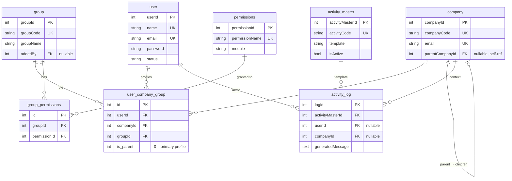
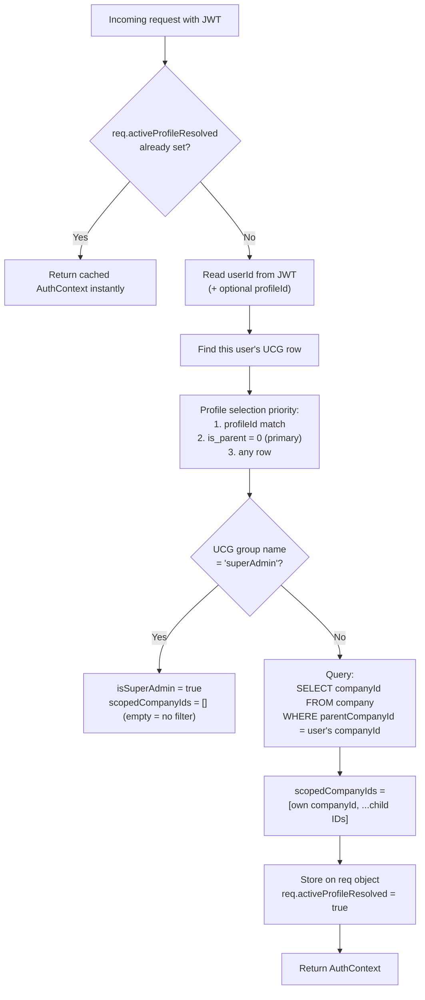
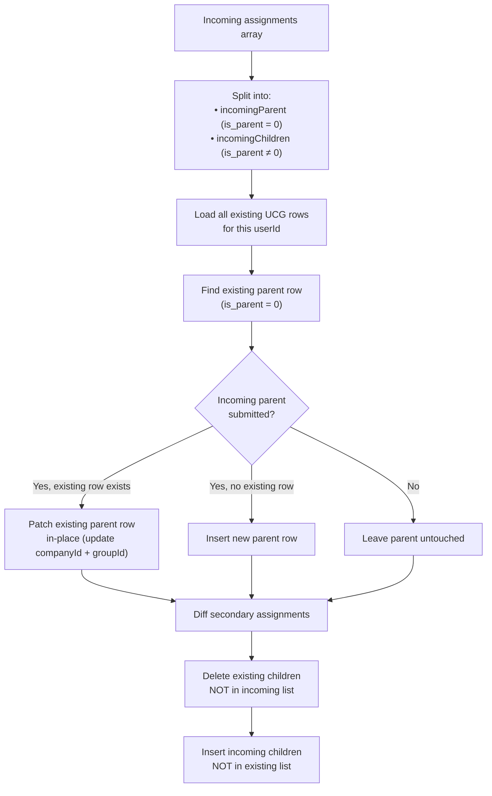
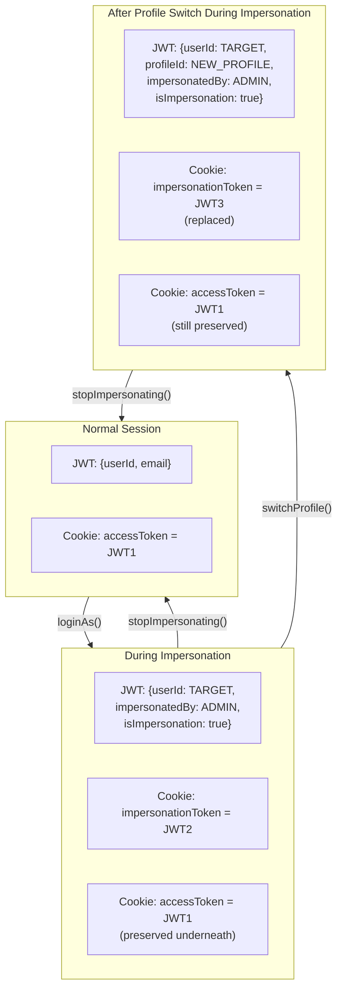
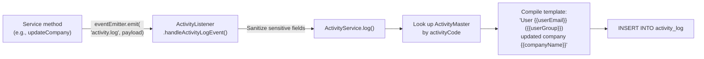

# Architecture Deep Dive: Non-Trivial Queries, Algorithms, and Patterns

_Last updated: 2026-07-24_

This document walks through every major piece of logic in the codebase that does real work — complex queries, algorithms, and architectural patterns that go beyond simple CRUD. Each section explains what problem the code solves, how it works step by step, and why it was built that way.

---

## Table of Contents

1. [The Data Model at a Glance](#1-the-data-model-at-a-glance)
2. [Scope Resolution: The Central Authority Algorithm](#2-scope-resolution-the-central-authority-algorithm)
3. [The Two-Pass User List Query](#3-the-two-pass-user-list-query)
4. [Group Visibility via Creator-Join Scoping](#4-group-visibility-via-creator-join-scoping)
5. [Circular Dependency Detection on Company Hierarchies](#5-circular-dependency-detection-on-company-hierarchies)
6. [The UCG Profile Diff Algorithm](#6-the-ucg-profile-diff-algorithm)
7. [The Group Permission Set-Diff Save](#7-the-group-permission-set-diff-save)
8. [The Dynamic Filter DSL](#8-the-dynamic-filter-dsl)
9. [The Relay Proxy Auth Chain](#9-the-relay-proxy-auth-chain)
10. [Impersonation and Profile Switching Token Management](#10-impersonation-and-profile-switching-token-management)
11. [The Event-Driven Audit Pipeline](#11-the-event-driven-audit-pipeline)
12. [How Scope Gets Applied Per Module](#12-how-scope-gets-applied-per-module)
13. [Bugs and Lessons Learned](#13-bugs-and-lessons-learned)

---

## 1. The Data Model at a Glance

Before diving into individual algorithms, it helps to see how the tables relate to each other. Five entities carry almost all the business logic:



The central table is `user_company_group` (UCG). It's a three-way join that says: "user X works at company Y in role Z." Nearly every non-trivial query in the system either reads from or writes to this table.

---

## 2. Scope Resolution: The Central Authority Algorithm

**Problem:** When a non-superAdmin user makes an API request, the system needs to answer: *which companies is this user allowed to see and modify?* The answer has to be computed once per request, cached so multiple guards and service methods don't re-query, and it has to account for the parent-child company hierarchy.

**Where it lives:** `auth-helper.ts` → `resolveAuthContext()`

### How It Works



**Step 1 — Find the user's active profile.** The function looks for a UCG row matching the user. It prefers a specific `profileId` if one was encoded in the JWT (from a profile switch), then falls back to the row where `is_parent = 0` (the primary profile), then to any row at all. This three-tier fallback is a chained nullish-coalescing pattern:

```typescript
const ucg = profileId
  ? (await repo.findOne({ where: { id: profileId, userId } }))
    ?? (await repo.findOne({ where: { userId, is_parent: 0 } }))
    ?? (await repo.findOne({ where: { userId } }))
  : (await repo.findOne({ where: { userId, is_parent: 0 } }))
    ?? (await repo.findOne({ where: { userId } }));
```

This is three separate database round-trips in the worst case — not a single query with OR conditions — because TypeORM's `findOne` with a `where` clause doesn't support "find this, or else that, or else anything" in a single call. The tradeoff is readability over a marginal performance cost that only hits on the first request of a session.

**Step 2 — Determine superAdmin status.** A single string comparison: `ucg.group?.groupName === 'superAdmin'`. SuperAdmins bypass all scope filtering — their `scopedCompanyIds` is left empty, and every downstream query checks `isSuperAdmin` before applying company filters.

**Step 3 — Build the scope array.** For non-superAdmins, the system queries the `company` table for direct children of the user's company:

```typescript
const directChildren = await companyRepo.find({
  where: { parentCompanyId: Number(ucg.companyId) },
  select: ['companyId'],
});
scopedCompanyIds = [
  Number(ucg.companyId),
  ...directChildren.map((c) => Number(c.companyId)),
];
```

This produces `[1, 5, 12]` — the user's own company plus its children.

**Step 4 — Cache.** The result is written to properties on the `req` object (`req.scopedCompanyIds`, `req.isSuperAdmin`, etc.), and `req.activeProfileResolved` is set to `true`. Any subsequent call to `resolveAuthContext` within the same HTTP request returns the cached values immediately without touching the database. This matters because a typical request passes through `PermissionsGuard` → `RolesGuard` → service method, and all three call `resolveAuthContext`.

### Why Direct Children Only, Not Full Subtree?

There's a commented-out BFS implementation (lines 99–133 of `auth-helper.ts`) that loads the entire company table and walks the tree to find all descendants. It was replaced because:

1. **O(n) memory on every request.** BFS loads every company row to build an adjacency map. For a system with hundreds of companies, that's a lot of unnecessary work.
2. **Single-depth is a deliberate policy choice.** Deep recursive scope is harder to reason about and audit. The single `WHERE parentCompanyId = ?` query is predictable and hits an indexed column.
3. **The BFS code is preserved.** If the business ever needs grandchild-level scoping, uncommenting one block gets it back.

---

## 3. The Two-Pass User List Query

**Problem:** Listing users with pagination sounds simple, but this system has a complication: users can have multiple company-group assignments, and the list must filter by company scope (from the hierarchy) while also supporting arbitrary frontend filters on fields from joined tables (like `groupName` and `companyName`). A single query with `JOIN` + `LIMIT` + `OFFSET` breaks pagination because the join produces multiple rows per user.

**Where it lives:** `user.service.ts` → `getUsers()`

### How It Works

**Pass 1 — Collect filtered IDs.** The first query joins `user` with `user_company_group`, `company`, and `group`, applies all filter conditions and scope restrictions, but only selects `user.userId`:

```typescript
const baseQB = this.userEntity
  .createQueryBuilder('user')
  .leftJoin('user.userCompanyGroups', 'ucg')
  .leftJoin('ucg.company', 'company')
  .leftJoin('ucg.group', 'group');

// Company scope filter
if (req?.scopedCompanyIds?.length) {
  baseQB.andWhere('ucg.companyId IN (:...companyIds)', {
    companyIds: req.scopedCompanyIds,
  });
}

// Dynamic user-defined filters
const filterString = await this.filter.makeFilterString(
  param?.filters, 'user',
  { groupName: 'group', companyName: 'company' },
);
if (filterString) baseQB.andWhere(`(${filterString})`);

const allIds = await baseQB.select('user.userId').getMany();
```

This returns a deduplicated list of matching user IDs. The deduplication happens naturally because `select('user.userId')` with `getMany()` returns distinct `UserEntity` objects.

**Pass 2 — Load full data for one page.** The IDs are sliced in application code to get one page worth, then a second query loads the complete user data with eager joins only for those IDs:

```typescript
const pageIds = allIds
  .slice(skip, skip + limit)
  .map((u) => u.userId);

const data = await this.userEntity
  .createQueryBuilder('user')
  .whereInIds(pageIds)
  .leftJoinAndSelect('user.userCompanyGroups', 'ucg')
  .leftJoinAndSelect('ucg.company', 'company')
  .leftJoinAndSelect('ucg.group', 'group')
  .getMany();
```

### Why Not a Single Query?

If you write `SELECT user.*, ucg.*, company.*, group.* ... LIMIT 10`, and a user has 3 company assignments, that user consumes 3 rows of your limit. Page 1 might show 4 users instead of 10, and the counts would be wrong. The two-pass approach guarantees that "page 1, limit 10" always returns exactly 10 *users* (not 10 rows).

### The Scope-Aware Profile Selection

After loading the data, the code picks which company assignment to display as the user's "primary" for the list view. For scoped viewers (parent company admins), it prefers the assignment matching the viewer's company scope:

```typescript
const primary = req?.scopedCompanyIds?.length
  ? (allAssignments.find((a) =>
      req.scopedCompanyIds.includes(a.companyId)) ??
    allAssignments.find((a) => a.is_parent === 0) ??
    allAssignments[0])
  : (allAssignments.find((a) => a.is_parent === 0) ??
    allAssignments[0]);
```

This means a parent company admin looking at a user who works at both the parent and a subsidiary will see the *relevant* profile — not necessarily the user's global primary.

---

## 4. Group Visibility via Creator-Join Scoping

**Problem:** Groups (roles) don't belong to a company — they're shared system-wide. But a parent company admin shouldn't be able to see or modify groups created by an unrelated company. How do you scope a table that has no `companyId` column?

**Where it lives:** `group.service.ts` → `getGroups()`, `getGroupsForDropdown()`, `getGroup()`, `startUpdate()`

### The Solution: Scope Through the Creator

The `group` table has an `addedBy` column — the `userId` of whoever created it. System-seeded groups have `addedBy = null`. The scoping query joins through the *creator's* UCG row to discover which company the creator belongs to:

```typescript
queryBuilder.leftJoin(
  UserCompanyGroupEntity,
  'creator_ucg',
  'creator_ucg.userId = group.addedBy',
);
queryBuilder.andWhere(
  '(group.addedBy IS NULL OR creator_ucg.companyId IN (:...scopedCompanyIds))',
  { scopedCompanyIds },
);
```

**What this produces in SQL:**

```sql
SELECT group.*
FROM `group`
LEFT JOIN user_company_group creator_ucg
  ON creator_ucg.userId = group.addedBy
WHERE group.groupName != 'superAdmin'
  AND (group.addedBy IS NULL
       OR creator_ucg.companyId IN (1, 5, 12))
```

The `IS NULL` clause ensures system-seeded groups (like `companyAdmin`) — which were created without a user and have no `addedBy` — are still visible to everyone. Without it, they'd be invisible.

For single-group views and updates, the same pattern is applied with `findOne` + an explicit scope check:

```typescript
const creatorUcg = await this.ucgEntity.findOne({
  where: { userId: group.addedBy, companyId: In(scopedCompanyIds) },
});
if (!creatorUcg) throw new ForbiddenException('...');
```

### Why Not Add a `companyId` to the Group Table?

Because groups are genuinely shared. The same "companyAdmin" role is used across every company. Adding a `companyId` would require duplicating the role for every company, which defeats the purpose of having a shared role system. The creator-join pattern is the least-invasive way to scope a shared entity.

---

## 5. Circular Dependency Detection on Company Hierarchies

**Problem:** When updating a company's `parentCompanyId`, you can create a cycle (A → B → C → A) that would break scope resolution, create infinite loops, and corrupt the hierarchy. This must be prevented at write time.

**Where it lives:** `company.service.ts` → `updateCompany()`, lines 268–288

### The Algorithm

It walks up the ancestor chain from the proposed parent and checks whether it ever encounters the target company:

```typescript
let currentId: number | null = newParentId;
const visited = new Set<number>();

while (currentId !== null) {
  if (currentId === targetCompanyId) {
    // Setting this parent would create: target → ... → newParent → ... → target
    return { success: 0, message: 'Would create a circular dependency' };
  }
  if (visited.has(currentId)) break;  // corrupted data safety net
  visited.add(currentId);

  const ancestor = await this.companyEntity.findOne({
    where: { companyId: currentId },
    select: ['companyId', 'parentCompanyId'],
  });
  currentId = ancestor?.parentCompanyId
    ? Number(ancestor.parentCompanyId)
    : null;
}
```

**Walk-through with an example.** Companies are arranged A → B → C. Someone tries to make C the parent of A (which would create A → C → B → A):

| Iteration | `currentId` | Is it the target (A)? | Action |
|-----------|-------------|----------------------|--------|
| 1 | C | No | Look up C's parent → B |
| 2 | B | No | Look up B's parent → A |
| 3 | A | **Yes** | Reject |

**The self-reference check** fires before the walk even starts: `if (newParentId === targetCompanyId)` catches the trivial case where a company is being set as its own parent.

**The `visited` set** isn't just for cycle detection — it's a safety net against corrupted data. If a cycle already existed in the database (from a direct SQL manipulation), the ancestor walk would loop forever. The set guarantees termination.

### Why Not a Recursive CTE?

A database-level recursive CTE (`WITH RECURSIVE`) could do the same check in a single query. But this codebase uses TypeORM's query builder, which doesn't have native CTE support without dropping to raw SQL. The application-level walk is straightforward, correct, and the depth of company hierarchies is typically small (2–4 levels), so the N+1 query cost is negligible.

---

## 6. The UCG Profile Diff Algorithm

**Problem:** When updating a user's company-group assignments, the system receives a list of desired assignments from the frontend. It needs to figure out what to add, what to remove, and what to leave alone — without destroying the user's primary profile (`is_parent = 0`) row.

**Where it lives:** `user.service.ts` → `saveAssignments()`

### How the Diff Works

The function operates in two modes: **append** (add new assignments without touching existing ones) and **replace** (sync the database to match exactly what was submitted). Replace mode is the interesting one:



**The critical design decision:** The parent row (`is_parent = 0`) is updated in-place, never deleted and re-created. This prevents a moment where the user has no primary profile — which would break `resolveAuthContext` if a request came in at exactly the wrong time.

For secondary rows, the diff uses a set-matching comparison on `(companyId, groupId)` pairs:

```typescript
// What to delete: existing children not in the incoming list
const toDelete = existingChildren.filter(
  (ext) => !incomingChildren.some(
    (inc) => Number(inc.companyId) === ext.companyId
          && Number(inc.groupId) === ext.groupId,
  ),
);

// What to insert: incoming children not in the existing list
const toInsert = incomingChildren.filter(
  (inc) => !existingChildren.some(
    (ext) => ext.companyId === Number(inc.companyId)
          && ext.groupId === Number(inc.groupId),
  ),
);
```

This is O(n×m) but both lists are typically tiny (a user rarely has more than 3–5 assignments), so performance is irrelevant.

---

## 7. The Group Permission Set-Diff Save

**Problem:** The permissions management page sends the full list of permission names that a group should have. The backend needs to reconcile this with what's already in the database — adding new grants, removing revoked ones, and leaving unchanged ones alone.

**Where it lives:** `group.service.ts` → `saveGroupPermissions()`

### How It Works

**Step 1 — Build lookup maps.** Load all permissions from the `permissions` table and build a `name → id` map. Then load all existing `group_permissions` rows for this group.

**Step 2 — Compute the diff:**

```typescript
const requestedIds = new Set(
  permissionNames.map((name) => nameToId[name]).filter(Boolean),
);
const existingIds = new Set(existing.map((e) => e.permissionId));

// Remove: in DB but not in request
const toDelete = existing.filter((e) => !requestedIds.has(e.permissionId));

// Add: in request but not in DB
const toInsert = [...requestedIds]
  .filter((id) => !existingIds.has(id))
  .map((permissionId) =>
    this.groupPermissionEntity.create({ groupId, permissionId }),
  );
```

This is a textbook set-difference operation. Using `Set` for the lookups makes the membership checks O(1) instead of O(n).

### The Non-SuperAdmin Guard

Non-superAdmins are forbidden from modifying `group`-prefixed permissions (which control access to the group management module itself). The guard compares the existing group-level permissions with the submitted ones and rejects if there's any difference:

```typescript
const existingSet = new Set(existingGroupPermNames);
const requestedSet = new Set(requestedGroupPermNames);

if (existingSet.size !== requestedSet.size) { mismatch = true; }
else {
  for (const item of existingSet) {
    if (!requestedSet.has(item)) { mismatch = true; break; }
  }
}
```

This is a strict set-equality check — not just a subset check. It prevents non-superAdmins from both adding *and removing* group-level permissions.

---

## 8. The Dynamic Filter DSL

**Problem:** The frontend sends arbitrary filter criteria (like "company name contains 'acme'" or "status equals 'active'") as JSON arrays. The backend needs to turn these into safe WHERE clauses that work across different tables in a join.

**Where it lives:** `filter.ts` → `makeFilterString()`, `filterCondition()`

### How It Works

The input is an array of objects like `[{ key: "companyName", operator: "contains", value: "acme" }]`. The function iterates over them, resolves which table alias each field belongs to, and builds a WHERE string:

```typescript
// aliasMap tells the filter which fields belong to joined tables
const filterString = await this.filter.makeFilterString(
  param?.filters,
  'user',                                        // default alias
  { groupName: 'group', companyName: 'company' }, // field → alias overrides
  'All',                                         // AND vs OR
);
```

The `aliasMap` parameter is the key non-obvious piece. Without it, filtering on `companyName` would produce `user.companyName` — which doesn't exist. With it, the filter correctly produces `company.companyName LIKE "%acme%"`.

Supported operators map to SQL:

| Frontend operator | SQL output |
|-------------------|------------|
| `equal` | `alias.key = "value"` |
| `greaterThan` | `alias.key > "value"` |
| `smallerThan` | `alias.key < "value"` |
| `begin` | `alias.key LIKE "value%"` |
| `contains` | `alias.key LIKE "%value%"` |
| `end` | `alias.key LIKE "%value"` |

### The Pagination Helper

`calcPages()` has a subtle edge-case handler: if the requested page overshoots the total count, it clamps the skip value instead of returning an empty set:

```typescript
if (cnt < (page - 1) * limit) {
  skip = cnt - limit - 1;  // pull back to the last valid page
}
```

This prevents the frontend from getting an empty page when items are deleted between page loads.

---

## 9. The Relay Proxy Auth Chain

**Problem:** The frontend (Next.js) and backend (NestJS) are separate applications. JWTs should never be stored in `localStorage` (XSS-extractable), but the frontend needs to send them with every API request. The solution is a server-side relay proxy that manages `httpOnly` cookies.

**Where it lives:** `frontend/src/app/relayapi/route.js`

### The Token Flow

```mermaid
sequenceDiagram
    participant Browser
    participant NextJS as "Next.js Relay<br/>(route.js)"
    participant NestJS as "NestJS Backend"

    Note over Browser: User submits login form
    Browser->>NextJS: POST /relayapi<br/>{endpoint: "user-login", body: credentials}
    NextJS->>NestJS: POST /user/user-login<br/>{credentials}
    NestJS-->>NextJS: {encrypted: "..."}<br/>Header: x-auth-token: eyJ...
    Note over NextJS: Reads x-auth-token header<br/>Sets httpOnly cookie
    NextJS-->>Browser: {encrypted: "..."}<br/>Set-Cookie: accessToken=eyJ...; httpOnly

    Note over Browser: Subsequent API calls
    Browser->>NextJS: GET /relayapi<br/>{endpoint: "company-list"}<br/>Cookie: accessToken=eyJ...
    Note over NextJS: Reads accessToken from cookie<br/>Adds Authorization header
    NextJS->>NestJS: GET /company/company-list<br/>Authorization: Bearer eyJ...
    NestJS-->>NextJS: {encrypted: "..."}
    NextJS-->>Browser: {encrypted: "..."}
```

**The key design choices:**

1. **Tokens travel via response headers**, not the JSON body. The backend puts the JWT in `x-auth-token`, and the relay proxy reads it from the response headers before the browser ever sees it.

2. **The browser never has access to the raw JWT.** The cookie is `httpOnly`, so JavaScript can't read it. The relay proxy reads it server-side and injects the `Authorization: Bearer` header on outbound requests.

3. **Impersonation tokens take precedence.** `getAuthToken()` checks for an `impersonationToken` cookie first, then `accessToken`. This means during impersonation, all API calls automatically use the impersonated user's token without any frontend logic change.

4. **Module-based routing.** The relay reads a `module` header from the frontend request and maps it to a backend URL prefix: `company` → `/company`, `user` → `/user`, etc. Unknown modules fall through to the bare root — a documented risk that causes confusing 404s.

---

## 10. Impersonation and Profile Switching Token Management

**Problem:** SuperAdmins need to "log in as" another user for debugging. Regular users need to switch between their company profiles. Both operations require re-issuing JWTs with different claims, but impersonation must be reversible — the original session has to survive underneath.

**Where it lives:** `user.service.ts` → `loginAs()`, `switchProfile()`, `stopImpersonating()` · `route.js` → POST handler · `LoginContext.jsx`

### The Token Layering



**Impersonation** doesn't touch the `accessToken` cookie. It only adds an `impersonationToken` cookie. Since `getAuthToken()` prefers `impersonationToken`, all subsequent requests automatically use the impersonated identity. When impersonation ends, only the `impersonationToken` cookie is cleared — the original `accessToken` is still there, and the session reverts seamlessly.

**Profile switching** re-signs the JWT with a `profileId` claim baked in. This claim flows through to `resolveAuthContext`, which uses it to select the UCG row for that specific profile instead of the primary. The token is placed in whichever cookie is appropriate — `impersonationToken` if currently impersonating, `accessToken` otherwise.

### Frontend Session Management

The `LoginContext` mirrors the cookie layering in React state:

- `isLogin` — the real logged-in user
- `impersonating` — the impersonated user (null when not impersonating)
- `displayUser` — a computed memo that returns `impersonating ?? isLogin`
- `originalActiveAssignment` — stashed in sessionStorage before impersonation so it can be restored

On `stopImpersonating()`, the context restores the original assignment and permissions from storage instead of making an API call, because the real user's session data hasn't changed.

---

## 11. The Event-Driven Audit Pipeline

**Problem:** Every significant action (login, user creation, company update, etc.) needs to be logged with a consistent format, but the audit logic shouldn't be tangled into the business logic of each service.

**Where it lives:** Services emit → `ActivityListener` intercepts → `ActivityService.log()` persists

### The Pipeline



**Template compilation** is a simple Mustache-style regex replacement:

```typescript
private compileMessage(template: string, params: any): string {
  return template.replace(/\{\{(\w+)\}\}/g, (match, key) => {
    return params[key] !== undefined ? String(params[key]) : match;
  });
}
```

If a parameter is missing from the payload, the placeholder is left as-is (`{{missingField}}`), which makes debugging obvious — you see the unreplaced tag in the log.

**Sensitive field redaction** happens in the listener, before the data reaches the service. The listener checks parameter keys against a blocklist (`password`, `token`, `otp`, etc.) using substring matching:

```typescript
if (sensitiveKeys.some((sk) => key.toLowerCase().includes(sk))) {
  sanitized[key] = '[REDACTED]';
}
```

The substring match (`includes`) rather than exact match is intentional — it catches `newPassword`, `confirmpass`, `passwordcheck`, etc., without needing to enumerate every variation.

### Why Event-Driven Instead of Direct Calls?

1. **Decoupling.** Services don't need to import or know about `ActivityService`. They just emit an event. If the audit system is down or the listener throws, the business operation still succeeds.
2. **Cross-cutting concern.** Every module emits the same event shape. Adding audit logging to a new feature is a one-liner `emit()` call.
3. **Sanitization at a single choke point.** The listener is the only place sensitive data gets scrubbed, rather than relying on every service to remember to redact.

---

## 12. How Scope Gets Applied Per Module

Once `resolveAuthContext` populates `req.scopedCompanyIds`, each module uses it differently:

| Module | What's scoped | How it's scoped | Relevant function |
|--------|--------------|----------------|-------------------|
| **Company** (list) | Which companies appear in the list | `WHERE companyId IN (:...scopedCompanyIds)` | `getCompanies()` |
| **Company** (detail/update) | Whether you can view or modify a specific company | `scopedCompanyIds.includes(targetId)` check | `getCompany()`, `startUpdate()` |
| **User** (list) | Which users appear in the list | `JOIN ucg WHERE ucg.companyId IN (...)` | `getUsers()` |
| **User** (detail) | Whether you can view a specific user | Check if *any* of the user's UCG rows overlap with viewer's scope | `getUser()` |
| **User** (update) | Whether you can modify a user AND their assignments | Two checks: user in scope + submitted companyId in scope | `startUpdate()` |
| **User** (add/delete profile) | Whether you can manage a profile for a given company | `scopedCompanyIds.includes(companyId)` | `addProfile()`, `deleteProfile()` |
| **Group** (list) | Which groups appear in the list | Join on creator's UCG; `IS NULL OR creator's company IN (...)` | `getGroups()` |
| **Group** (detail/update) | Whether you can view or modify a specific group | Same creator-company check | `getGroup()`, `startUpdate()` |
| **Activity** (list) | Which audit log entries you can see | `WHERE activity_log.companyId IN (...)` | `listLogs()` |

The `PermissionsGuard` and `RolesGuard` both call `resolveAuthContext` as their first action, ensuring `req.scopedCompanyIds` is always populated before any service method runs — even if the service method doesn't explicitly check scope.

---

## 13. Bugs and Lessons Learned

These are real issues that surfaced during development and verification. Each one has a pattern that generalizes beyond this codebase.

---

### BFS Scope Resolution Loading the Entire Company Table

**What happened:** The initial scope resolution loaded all companies into memory and ran BFS to find the full descendant tree. This was O(n) memory and network I/O on every authenticated request.

**Fix:** Replaced with a single `WHERE parentCompanyId = ?` query returning only direct children.

**Takeaway:** Application-level tree traversals should be a last resort. For single-depth scope, a targeted indexed query always wins. For deep scope, consider recursive CTEs or materialized paths before in-memory walks.

---

### User List Showing Users From Unrelated Companies

**What happened:** The user list query joined through UCG but didn't filter by `scopedCompanyIds`. Any user with a shared group name appeared for everyone.

**Fix:** Added `ucg.companyId IN (:...companyIds)` to the query.

**Takeaway:** A join is not a filter. Joining through a company table doesn't restrict results to the right companies — the `WHERE` clause does. Always trace the query mentally: "after all joins, which rows survive? Do any unintended ones sneak through?"

---

### Profile Add/Delete Bypassing Scope

**What happened:** `addProfile` let any authenticated user create a UCG row for any company. A subsidiary admin could give themselves a profile at the parent company and escalate their access.

**Fix:** Added `scopedCompanyIds.includes(companyId)` check before insertion. Same for `deleteProfile`.

**Takeaway:** Any operation that creates or modifies user-company-group mappings is a privilege escalation vector. The write path needs the same scope checks as the read path — or stricter.

---

### Cross-Company Reassignment on User Update

**What happened:** Updating a user's `companyId` wasn't validated against the caller's scope. A scoped admin could reassign a user to any company.

**Fix:** Added a second scope check specifically for the submitted `companyId`, independent of the target user check.

**Takeaway:** A single mutation can touch multiple scoped entities. "Can you see this user?" and "can you assign to this company?" are separate questions that both need their own answer.

---

### Group Scoping Oversight

**What happened:** Groups are system-wide, so they initially had no company-level access control. Any user could see and modify any group.

**Fix:** Creator-join scoping (Section 4 above).

**Takeaway:** When an entity doesn't have a direct company column, scope it through its creator, its owner, or some other indirect relationship. "No company column" doesn't mean "no company restriction needed."

---

### `calcPages` Returning Negative Skip

**What happened:** If items were deleted between the frontend paginator's state and the actual query, `(page - 1) * limit` could exceed the total count, and the fallback `cnt - limit - 1` could go negative.

**Current state:** The `if (param.page <= 0) { skip = 0; }` guard catches the most obvious case, but a page that overshoots the count still produces a potentially negative skip. The two-pass user query sidesteps this in practice because it slices in application code (`allIds.slice(skip, skip + limit)`) rather than using database-level OFFSET, but the issue exists in `calcPages` for other callers.

**Takeaway:** Pagination math needs clamping at both ends: `skip = Math.max(0, Math.min(skip, total - 1))`. Test with empty result sets and with deletion between page loads.

---

### Response Encryption Not Decrypted on Frontend

**What happened:** Multiple frontend components fetched API responses (which are AES-encrypted by the backend via `encryptResponse()`) but tried to use them as plain JSON. Fields showed up as `undefined` or blank.

**Fix:** Added `decryptResponse(payload.encrypted)` calls in every affected component.

**Takeaway:** If your API encrypts responses, the decryption step is load-bearing infrastructure, not optional convenience. Every single consumer of the API must decrypt. A single missed spot produces silent data loss, not an error. Consider making decryption happen at the transport layer (in the relay proxy) so components never see encrypted data.
