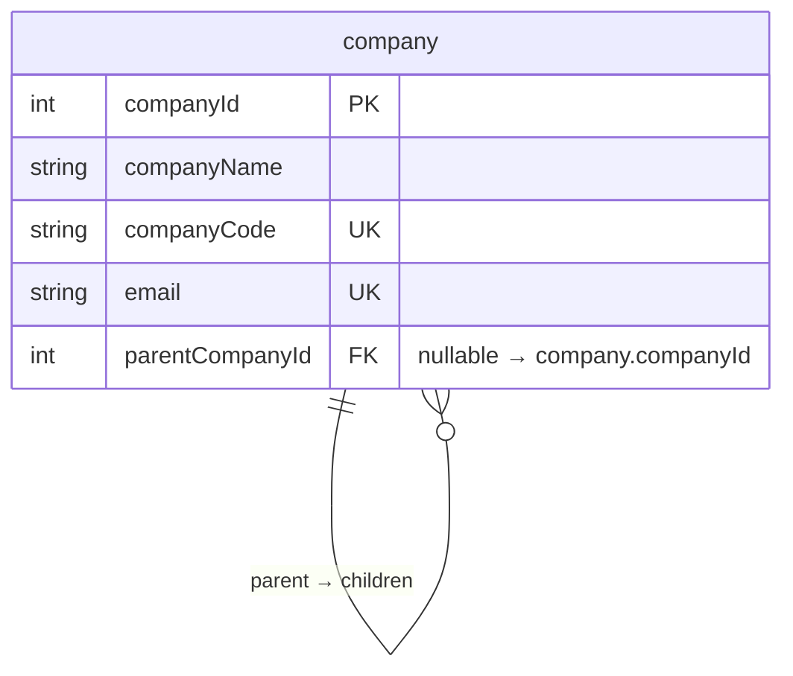
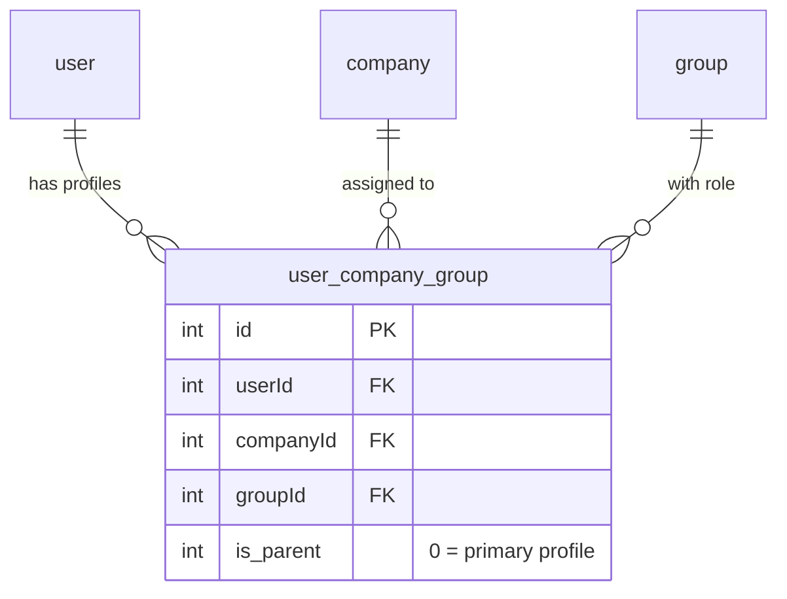
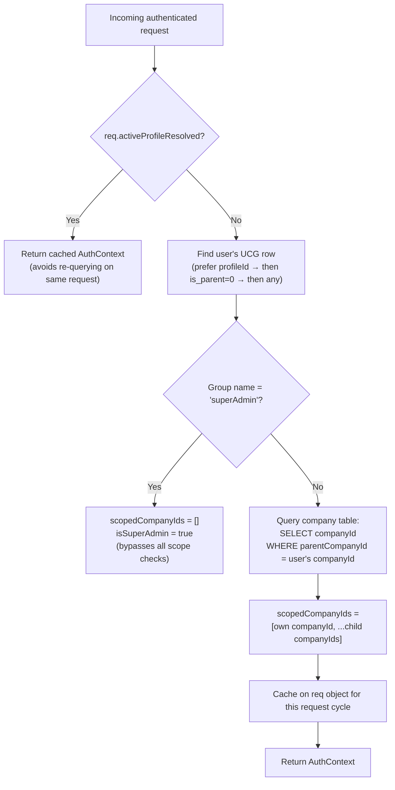
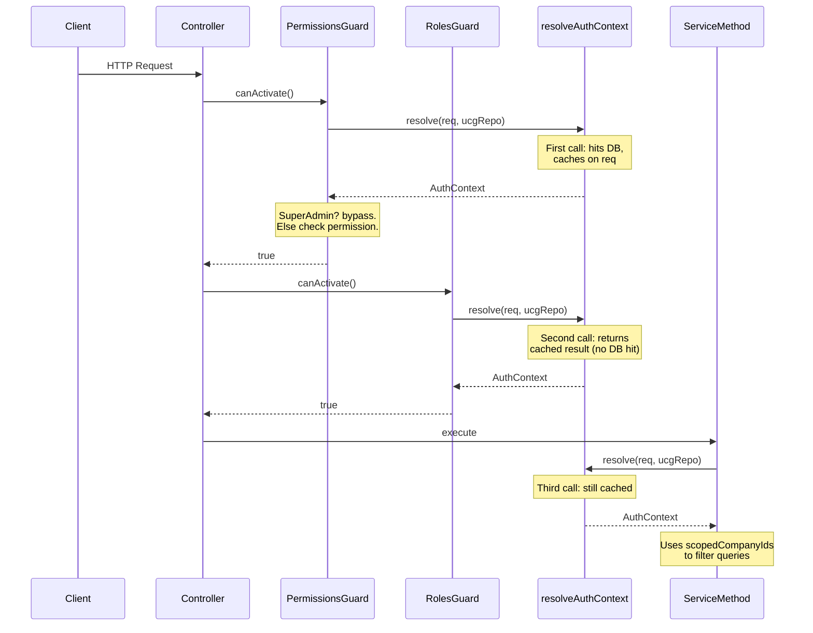
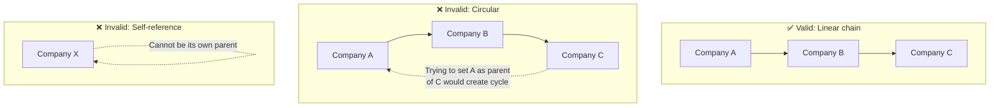

# Parent-Child Company Hierarchy & Scope Propagation

_Last updated: 2026-07-24_

---

## What This Feature Does

Before this feature, every company in the system was a flat, independent entity. A user logged into Company A could only see Company A's data, and a superAdmin could see everything. There was no concept of "this company owns that company."

The parent-child hierarchy introduces a tree structure where a company can have a single parent and any number of children. When a non-superAdmin user logs in to a parent company, they automatically gain read and write access to all of that parent's direct child companies — without needing a separate user-company-group assignment for each one.

This is the foundation for multi-tenant scoping: a holding company can manage its subsidiaries from a single admin panel without superAdmin privileges.

---

## The Data Model

### The Self-Referencing Foreign Key

The hierarchy lives in a single column on the `company` table:

```
company
├── companyId        (PK, auto-increment)
├── companyName
├── companyCode      (unique)
├── email            (unique)
├── ...
└── parentCompanyId  (FK → company.companyId, nullable, ON DELETE SET NULL)
```

`parentCompanyId` is a self-referencing foreign key: it points back to the same `company` table. When it's `NULL`, the company is a top-level (root) company. When it points to another company's `companyId`, that company is a child.



The `ON DELETE SET NULL` behaviour is deliberate: if a parent company is ever deleted, its children don't get cascade-deleted — they become orphaned root companies instead. This is a safety net against accidental data loss.

### The TypeORM Entity

The entity in `company.entity.ts` declares both sides of the relationship:

```typescript
// The "many" side — a company has at most one parent
@ManyToOne(() => CompanyEntity, (company) => company.children, {
  nullable: true,
  onDelete: 'SET NULL',
})
@JoinColumn({ name: 'parentCompanyId' })
parentCompany!: CompanyEntity | null;

// The "one" side — a company can have many children
@OneToMany(() => CompanyEntity, (company) => company.parentCompany)
children!: CompanyEntity[];
```

### The Join Table That Makes It All Work: `user_company_group`

The hierarchy itself is just data. What makes it *do* anything is how it interacts with the existing `user_company_group` (UCG) table, which maps users to companies and roles:



A user's UCG row tells us: "this user works at *this* company in *this* role." The hierarchy then extends that: "…and because that company has children, they also have access to those children."

---

## How Scope Resolution Works

This is the single most important algorithm in the feature. Every time a non-superAdmin user makes an authenticated API request, the system needs to answer: **"which company IDs is this user allowed to touch?"**

### The `resolveAuthContext` Function

The scope resolution lives in `auth-helper.ts` in a single function called `resolveAuthContext`. Here's what it does, step by step:



The key query for non-superAdmins is:

```typescript
const directChildren = await companyRepo.find({
  where: { parentCompanyId: Number(ucg.companyId) },
  select: ['companyId'],
});

scopedCompanyIds = [
  Number(ucg.companyId),
  ...directChildren.map((c) => Number(c.companyId)),
];
```

This produces an array like `[1, 5, 12]` — "company 1 (the user's own) plus companies 5 and 12 (its children)."

### Why Only Direct Children, Not the Whole Subtree?

There's a commented-out block in `auth-helper.ts` (lines 99–133) that implements full recursive BFS traversal — it loads *all* companies, builds an adjacency map, then walks the tree from the user's company downward:

```typescript
// Commented-out BFS approach:
// const queue = [Number(ucg.companyId)];
// while (queue.length > 0) {
//   const currentId = queue.shift()!;
//   if (!visited.has(currentId)) {
//     visited.add(currentId);
//     const children = childrenMap.get(currentId) || [];
//     for (const childId of children) queue.push(childId);
//   }
// }
```

This was deliberately replaced with the simpler single-depth query. The reasons:

1. **Performance**: The BFS approach loads the *entire* company table into memory on every request. For a system with hundreds of companies, that's wasteful. The single-depth query hits a single indexed `WHERE parentCompanyId = ?`.

2. **Predictability**: Deep recursive scope is hard to reason about. If Company A owns B, and B owns C, does A's admin really need implicit access to C? That's a policy question, and the simpler single-depth model makes the access boundary obvious.

3. **The option is preserved**: The BFS code is commented out, not deleted. If requirements change to need full subtree scoping, it's a one-block uncomment.

### Request-Level Caching

`resolveAuthContext` caches its result on the `req` object by setting `req.activeProfileResolved = true`. This means if multiple guards or service methods call `resolveAuthContext` within the same HTTP request, only the first call hits the database. Every subsequent call returns instantly from the cached values. This is important because a typical request passes through `PermissionsGuard` → `RolesGuard` → service method, and each one needs the auth context.

---

## How Each Module Uses Scoping

Once `scopedCompanyIds` is resolved, each module applies it differently depending on what it's protecting. Here's how each one works:

### Company Module

**Listing companies** (`getCompanies`): Adds a `WHERE companyId IN (:...scopedCompanyIds)` clause to the query builder. A parent company admin sees their own company plus all children. A superAdmin sees everything (no filter applied).

**Viewing a single company** (`getCompany`): Checks `scopedCompanyIds.includes(targetCompanyId)` before returning data. Returns a `ForbiddenException` if the target isn't in scope.

**Updating a company** (`startUpdate` / `updateCompany`): Double-checks scope at *both* the entry point (`startUpdate`) and the inner method. This is an intentional defence-in-depth pattern — even if someone calls `updateCompany` directly (e.g., from a future endpoint), the scope check still fires.

### User Module

**Listing users** (`getUsers`): Joins through the UCG table and filters with `ucg.companyId IN (:...companyIds)`. This means a parent company admin sees users who have *any* profile assignment to their company or a child company — even if that user's *primary* profile is elsewhere.

**Viewing a single user** (`getUser`): Checks whether *any* of the target user's company assignments overlap with `scopedCompanyIds`. This is a deliberate "any overlap" check rather than "primary must match" — because a user can have profiles in multiple companies.

**Updating a user** (`startUpdate`): Two scope checks:
1. The target user must have at least one UCG row with a `companyId` in the viewer's scope.
2. If the update includes a `companyId` (changing their assignment), that company must also be in scope.

**Adding/deleting profiles** (`addProfile` / `deleteProfile`): The `companyId` of the profile being added or deleted must be in the caller's `scopedCompanyIds`.

### Group Module

Groups are not company-specific (they're shared across the system), so the scoping works differently:

**Listing groups** (`getGroups` / `getGroupsForDropdown`): Joins on the *creator's* UCG to check whether the group's `addedBy` user belongs to one of the viewer's scoped companies. System groups (where `addedBy` is null) are always visible to everyone.

**Viewing/updating a group** (`getGroup` / `startUpdate`): Same creator-scoping check. Additionally, system groups (`addedBy === null`) cannot be modified by non-superAdmins at all.

**The scoping query for groups:**

```typescript
queryBuilder.leftJoin(
  UserCompanyGroupEntity,
  'creator_ucg',
  'creator_ucg.userId = group.addedBy',
);
queryBuilder.andWhere(
  '(group.addedBy IS NULL OR creator_ucg.companyId IN (:...scopedCompanyIds))',
  { scopedCompanyIds },
);
```

This is a non-trivial query worth understanding: it left-joins the group's creator's UCG row and checks if that creator is associated with a company the viewer can see. The `IS NULL` clause ensures system-seeded groups (no creator) aren't hidden.

### Activity Log Module

**Listing activity logs** (`listLogs`): Filters with `activity_log.companyId IN (:...companyIds)`. A parent company admin sees audit trail entries for actions taken at their company and all child companies. This is critical for audit: a holding company needs to see what happened at its subsidiaries.

### The Guard Layer

Both `PermissionsGuard` and `RolesGuard` call `resolveAuthContext` as their first action. This means *every* guarded endpoint — regardless of whether the service method explicitly checks scope — gets the `req.scopedCompanyIds` array populated. The guards themselves don't filter by company (that's the service's job), but they ensure the auth context is always available for services to use.



---

## Preventing Circular and Invalid Hierarchies

Setting a parent company is allowed in both `insertCompany` and `updateCompany`, but the update path has extra safety checks because that's where circular dependencies can be introduced. You can't create a cycle at insert time (the company doesn't exist yet), but you can at update time.

### The Circular Dependency Detection Algorithm

When updating a company's `parentCompanyId`, the system walks up the ancestor chain from the *proposed* parent and checks whether it ever encounters the target company. If it does, setting that parent would create a cycle.

```typescript
let currentId: number | null = newParentId;
const visited = new Set<number>();

while (currentId !== null) {
  if (currentId === targetCompanyId) {
    return { success: 0, message: 'Cannot set parent company: would create a circular dependency' };
  }
  if (visited.has(currentId)) break;   // safety: stop if we somehow loop
  visited.add(currentId);

  const ancestor = await this.companyEntity.findOne({
    where: { companyId: currentId },
    select: ['companyId', 'parentCompanyId'],
  });
  currentId = ancestor?.parentCompanyId ? Number(ancestor.parentCompanyId) : null;
}
```

Visually, here's what it's preventing:



### Step-by-step example

Suppose companies are arranged as A → B → C (A is parent of B, B is parent of C). Someone tries to make C the parent of A:

1. `newParentId = C`, `targetCompanyId = A`
2. Start at `currentId = C`. Is C === A? No. Add C to visited.
3. Look up C's parent → B. Is B === A? No. Add B to visited.
4. Look up B's parent → A. Is A === A? **Yes** → reject with "would create a circular dependency."

### The Self-Reference Check

Before the ancestor walk even begins, there's a simple check:

```typescript
if (newParentId === targetCompanyId) {
  return { success: 0, message: 'A company cannot be its own parent' };
}
```

This catches the trivial case where someone tries to set a company as its own parent, without needing the full ancestor walk.

### The `visited` Set as a Safety Net

The `visited` set isn't just for the cycle detection — it also protects against corrupted data. If somehow a cycle already existed in the database (e.g., from a direct SQL manipulation), the ancestor walk would loop forever. The `visited` set guarantees the loop terminates by breaking when it sees the same `currentId` twice.

---

## The Database Migration

The migration file (`1721564000000-AddParentCompanyIdToCompany.ts`) is commented out in the current codebase because the column was applied directly to the database. But it documents the intended migration approach:

1. **Idempotent column addition**: Checks `INFORMATION_SCHEMA.COLUMNS` before adding the column, so running the migration twice doesn't error.

2. **Idempotent foreign key addition**: Checks `INFORMATION_SCHEMA.TABLE_CONSTRAINTS` before adding the FK, for the same reason.

3. **Reversible**: The `down` method drops the FK first, then the column — in the correct dependency order.

The migration was designed for MySQL 8.0, where `ADD COLUMN IF NOT EXISTS` isn't reliably supported across all builds. The INFORMATION_SCHEMA approach works everywhere.

---

## Bugs Discovered During Development and Verification

### Bug 1: Scope Leaking Through Missing Guard Chain

**What happened:** Some service methods (like `updateCompany`) accepted a `req` parameter but didn't consistently check `resolveAuthContext` early enough. If a code path reached the database update before the scope check, a carefully crafted request could modify a company outside the user's scope.

**How it was fixed:** `startUpdate` was refactored to call `resolveAuthContext` and check `scopedCompanyIds` as its first action, *before* delegating to `updateCompany`. The inner `updateCompany` method has its own independent check too — defence-in-depth.

**Takeaway:** Always check scope at the entry point of an operation, not just inside the implementation. If the entry point delegates to a shared method, the shared method should also check independently.

---

### Bug 2: `getUsers` Returning Users From Unrelated Companies

**What happened:** The user list query joined through UCG but didn't filter by `scopedCompanyIds`, so a parent company admin could see users from completely unrelated companies that happened to share a group.

**How it was fixed:** Added `ucg.companyId IN (:...companyIds)` to the query builder when `scopedCompanyIds` is available.

**Takeaway:** A join is not a filter. Just because you join through a company table doesn't mean you're restricting results to the right companies. The `WHERE` clause is what actually enforces scope.

---

### Bug 3: Group Visibility Ignoring Company Scope

**What happened:** Groups don't have a `companyId` column — they're shared system-wide. This meant all groups were visible to all users, regardless of company scope. A subsidiary's admin could see and modify groups created by an unrelated company.

**How it was fixed:** The group list and detail views now join on the group creator's UCG row to determine which company the group "belongs to." If the creator's company isn't in the viewer's scope, the group is hidden.

**Takeaway:** When an entity doesn't have a direct company relationship, you can scope it indirectly through its *creator's* company affiliation. This is a common pattern for shared/global entities that still need company-level access control.

---

### Bug 4: BFS Scope Resolution Loading All Companies Into Memory

**What happened:** The initial implementation of deep-tree scope resolution used BFS traversal that loaded the entire company table into memory to build an adjacency list, then walked the tree. This worked but was O(n) in memory and network I/O on every single authenticated request.

**How it was fixed:** Replaced with a single `WHERE parentCompanyId = ?` query that returns only direct children. O(1) network round-trip, O(k) memory where k = number of children (typically small).

**Takeaway:** Depth-first or breadth-first traversals in application code are a red flag when the database can do the work. For single-depth scope, a single indexed query is always better. If deep scope is ever needed, consider recursive CTEs or materialised path columns instead of loading the whole table.

---

### Bug 5: Profile Addition Ignoring Scope Constraints

**What happened:** The `addProfile` endpoint let any authenticated user add a UCG row for any company — so a subsidiary admin could give themselves a profile at the parent company and escalate their access.

**How it was fixed:** Added a scope check: `if (req?.scopedCompanyIds?.length && !req.scopedCompanyIds.includes(Number(companyId)))` → reject. Same pattern applied to `deleteProfile`.

**Takeaway:** Profile management is a privilege escalation vector. Any operation that creates or modifies user-company-group mappings must verify that the *actor's* scope covers the target company.

---

### Bug 6: User Update Allowing Cross-Company Reassignment

**What happened:** Updating a user's `companyId` (changing their assignment) wasn't checked against the caller's scope. A parent company admin could reassign a user to a company outside their hierarchy.

**How it was fixed:** Added a second scope check specifically for the submitted `companyId` parameter, independent of the target user check.

**Takeaway:** Scope checks often need to cover *multiple* entities in a single operation. "Can you see this user?" and "can you assign to this company?" are two separate questions, and both must pass.

---

## Summary of Access Rules

| Role | Can see | Can modify | Scope source |
|------|---------|-----------|--------------|
| **superAdmin** | All companies, all users, all groups, all activity | Everything | No filter applied |
| **Parent company admin** | Own company + direct children | Own company + direct children (companies, users, groups created by their scope) | `resolveAuthContext` → `[own, ...children]` |
| **Leaf company user** | Own company only | Own company only (limited by role permissions) | `resolveAuthContext` → `[own]` |

---

## Where the Key Code Lives

| Concern | File | Key function/section |
|---------|------|---------------------|
| Scope resolution algorithm | `backend/src/utilities/auth-helper.ts` | `resolveAuthContext()` |
| Circular dependency prevention | `backend/src/company/company.service.ts` | `updateCompany()`, lines 268–288 |
| Company entity with self-join | `backend/src/packages/entity/company.entity.ts` | `parentCompanyId`, `parentCompany`, `children` |
| Company list scoping | `backend/src/company/company.service.ts` | `getCompanies()` |
| User list scoping | `backend/src/user/user.service.ts` | `getUsers()` |
| User detail scope check | `backend/src/user/user.service.ts` | `getUser()` |
| Profile add/delete scope check | `backend/src/user/user.service.ts` | `addProfile()`, `deleteProfile()` |
| Group list scoping (creator-based) | `backend/src/group/group.service.ts` | `getGroups()`, `getGroupsForDropdown()` |
| Group detail/update scope check | `backend/src/group/group.service.ts` | `getGroup()`, `startUpdate()` |
| Activity log scoping | `backend/src/activity/activity.service.ts` | `listLogs()` |
| Guard-level scope injection | `backend/src/utilities/permissions.guard.ts` | `canActivate()` |
| Guard-level scope injection | `backend/src/utilities/roles.guard.ts` | `canActivate()` |
| DB migration (commented) | `backend/src/migration/1721564000000-AddParentCompanyIdToCompany.ts` | Full file |
| Activity template update | `backend/src/migration/1721565000000-UpdateActivityMasterTemplates.ts` | `up()` |
